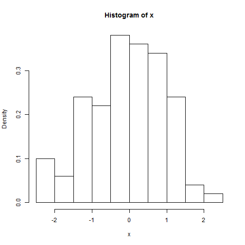
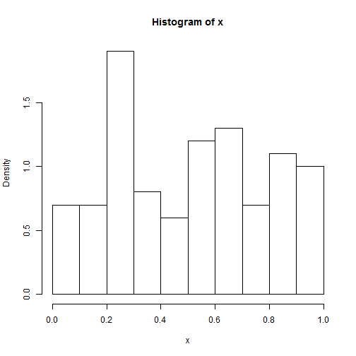
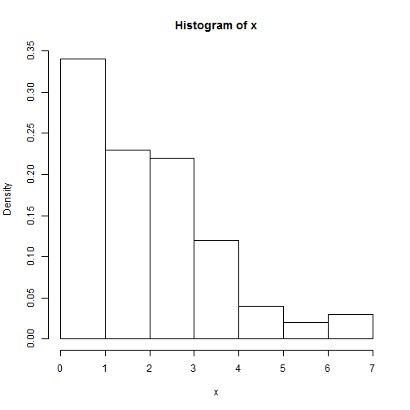
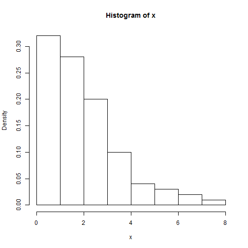
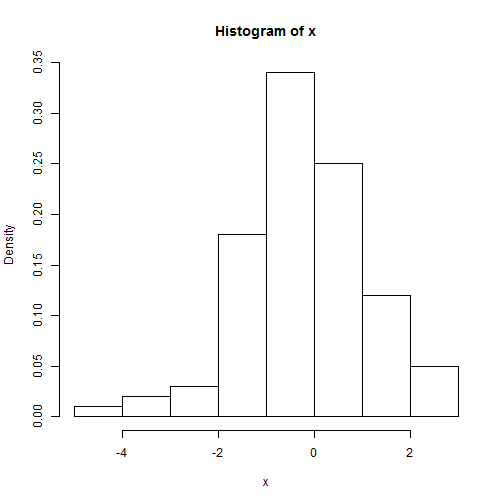

Advanced Statistics
========================================================
author: Bernhard Angele 
date: October 2nd, 2014

Advanced?
========================================================

For more details on authoring R presentations click the
**Help** button on the toolbar.

- Bullet 1
- Bullet 2
- Bullet 3

R basics
========================================================
Addition

```r
1+1
```

```
[1] 2
```
Subtraction

```r
1-1
```

```
[1] 0
```

R basics
========================================================
Multiplication and division

```r
4*3
```

```
[1] 12
```

```r
12/4
```

```
[1] 3
```

R basics
========================================================
Powers

```r
5^2
```

```
[1] 25
```

```r
2^3
```

```
[1] 8
```

Variables
========================================================

```r
x <- 5
x + 1
```

```
[1] 6
```


Commands
========================================================

```r
x <- 5
x + 1
```

```
[1] 6
```

```r
x
```

```
[1] 5
```
Is anyone surprised by this?

Functions
========================================================

```r
addOne <- function(x) {
  x+1
}
addOne(5)
```

```
[1] 6
```

```r
addOne(-3)
```

```
[1] -2
```

Types of data
========================================================

```r
x <- 1
y <- "test"
z <- c(1,2)
z
```

```
[1] 1 2
```
z is a **vector**

```r
z + 1
```

```
[1] 2 3
```

Vector operations
========================================================

```r
z <- c(1,2,3,4,5)
z + 2
```

```
[1] 3 4 5 6 7
```

```r
z - 1
```

```
[1] 0 1 2 3 4
```

```r
z * 2
```

```
[1]  2  4  6  8 10
```

More vector operations
========================================================

```r
z <- c(1,2,3,4,5)
sum(z)
```

```
[1] 15
```

```r
length(z)
```

```
[1] 5
```

```r
sum(z)/length(z)
```

```
[1] 3
```

Descriptive statistics
========================================================
We could define a new function that calculates the mean.
But maybe it's defined for us already?

```r
z <- c(1,2,3,4,5)
mean(z)
```

```
[1] 3
```

What about other descriptive statistics?
========================================================

```r
median(z)
```

```
[1] 3
```

```r
sd(z)
```

```
[1] 1.581
```

```r
var(z)
```

```
[1] 2.5
```

What about other descriptive statistics?
========================================================

```r
summary(z)
```

```
   Min. 1st Qu.  Median    Mean 3rd Qu.    Max. 
      1       2       3       3       4       5 
```


Simulate data
========================================================


```r
x<-rnorm(100)
head(x)
```

```
[1] -1.0117  0.7298 -0.8888  0.2415 -0.1542  0.7267
```

Simulated data (histogram)
========================================================


```r
## plot density histogram:
hist(x,freq=F)
```

 


Other distributions: Uniform
========================================================


```r
## plot density histogram:
x<-runif(100)
hist(x,freq=F)
```

 


Other distributions: Gamma
========================================================


```r
## plot density histogram:
x<-rgamma(100, 2)
hist(x,freq=F)
```

 


Other distributions: Gamma
========================================================


```r
## plot density histogram:
x<-rgamma(100, shape = 2)
hist(x,freq=F)
```

 

Other distributions: t
========================================================


```r
## plot density histogram:
x<-rt(100, df = 5)
hist(x,freq=F)
```

 
