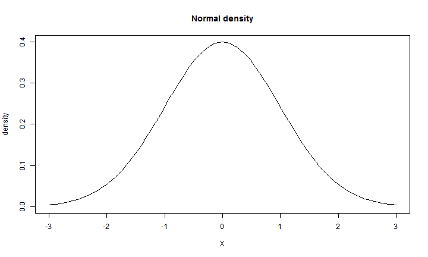

Advanced Statistics
========================================================
author: Bernhard Angele 
date: October 2nd, 2014

What is advanced about these statistics?
========================================================

- Goal is for you to understand the principles, not just the steps.
- Simulation approach:
  - If you don't know how something about a statistical test, simulate it!
  - Example questions you might ask:
    - What is the power of this test?
    - What happens if I violate the normality assumption for an ANOVA?
    - What happens if I don't correct for multiple comparisons?
  

How do I run simulations?
========================================================

- Not very easy in SPSS
- Very easy in R


R basics
========================================================
Addition

```r
1+1
```

```
[1] 2
```
Subtraction

```r
1-1
```

```
[1] 0
```

R basics
========================================================
Multiplication and division

```r
4*3
```

```
[1] 12
```

```r
12/4
```

```
[1] 3
```

R basics
========================================================
Powers

```r
5^2
```

```
[1] 25
```

```r
2^3
```

```
[1] 8
```

Variables
========================================================

```r
x <- 5
x + 1
```

```
[1] 6
```


Commands
========================================================

```r
x <- 5
x + 1
```

```
[1] 6
```

```r
x
```

```
[1] 5
```
Is anyone surprised by this?

Functions
========================================================

```r
addOne <- function(x) {
  x+1
}
addOne(5)
```

```
[1] 6
```

```r
addOne(-3)
```

```
[1] -2
```

Types of data
========================================================

```r
x <- 1
y <- "test"
z <- c(1,2)
z
```

```
[1] 1 2
```
z is a **vector**

```r
z + 1
```

```
[1] 2 3
```

Vector operations
========================================================

```r
z <- c(1,2,3,4,5)
z + 2
```

```
[1] 3 4 5 6 7
```

```r
z - 1
```

```
[1] 0 1 2 3 4
```

```r
z * 2
```

```
[1]  2  4  6  8 10
```

More vector operations
========================================================

```r
z <- c(1,2,3,4,5)
sum(z)
```

```
[1] 15
```

```r
length(z)
```

```
[1] 5
```

```r
sum(z)/length(z)
```

```
[1] 3
```

Descriptive statistics
========================================================
We could define a new function that calculates the mean.
But maybe it's defined for us already?

```r
z <- c(1,2,3,4,5)
mean(z)
```

```
[1] 3
```

What about other descriptive statistics?
========================================================

```r
median(z)
```

```
[1] 3
```

```r
sd(z)
```

```
[1] 1.581
```

```r
var(z)
```

```
[1] 2.5
```

Summary: lots of interesting descriptive statistics at once
========================================================

```r
summary(z)
```

```
   Min. 1st Qu.  Median    Mean 3rd Qu.    Max. 
      1       2       3       3       4       5 
```


Let's simulate some data
========================================================


```r
x<-rnorm(1000)
head(x)
```

```
[1] -0.4866  1.0756 -0.2712 -0.5775  0.8977  0.4816
```

```r
plot(x)
```

 

Distribution of the simulated data (histogram)
========================================================


```r
## plot density histogram:
par(mfrow=c(1,2)) # (little trick: two plots side-by-side)
hist(x,freq=F)
plot(density(x))
```

 

Probability density?
========================================================
 

Normal probability density function (PDF)
========================================================
$$
\begin{equation}
  f(x,\mu,\sigma) = \frac{1}{\sigma \sqrt{2 \pi}} e^{-((x - \mu)^2/2 \sigma^2)}
\end{equation}
$$
With $x$ = value, 
$\mu$ = population mean, 
and $\sigma$ = population standard deviation
 

Defining the normal PDF by hand (just in case you wanted to make sure)
========================================================
$$
\begin{equation}
  f(x,\mu,\sigma) = \frac{1}{\sigma \sqrt{2 \pi}} e^{-((x - \mu)^2/2 \sigma^2)}
\end{equation}
$$

```r
dnorm_manual <- function(x, mu = 0, sigma = 1) {1/(sigma*sqrt(2*pi)) * exp(-((x-mu)^2/2*sigma^2))}
plot(function(x) dnorm_manual(x), -3, 3,
main = "Normal density",ylim=c(0,.4),
ylab="density",xlab="X")
```

 

Why do we use the normal distribution?
========================================================


Other distributions: Uniform
========================================================


```r
## plot density histogram:
x <- runif(n = 1000)
par(mfrow=c(1,2)) # (two plots side-by-side)
hist(x,freq=F)
plot(density(x))
```

 


Other distributions: Gamma
========================================================


```r
## plot density histogram:
x<-rgamma(n = 1000, shape = 2)
par(mfrow=c(1,2)) # (two plots side-by-side)
hist(x,freq=F)
plot(density(x))
```

 
