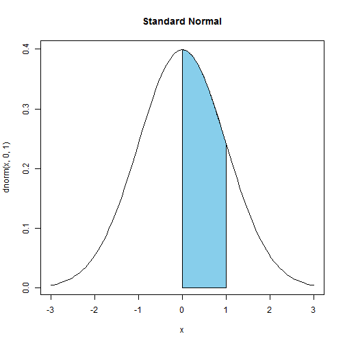
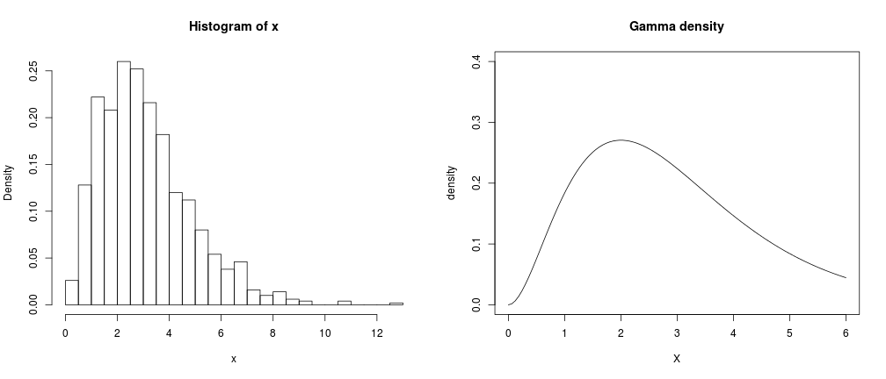
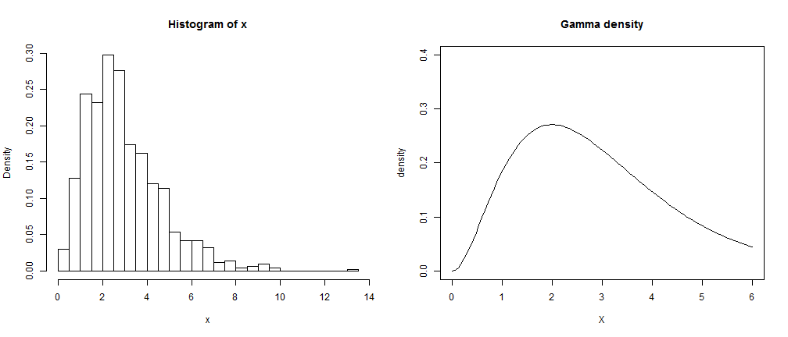

Advanced Statistics
========================================================
author: Bernhard Angele 
date: October 2nd, 2014

What is advanced about these statistics?
========================================================

- Goal is for you to understand the principles, not just the steps.
- Simulation approach:
  - If you don't know how something about a statistical test, simulate it!
  - Example questions you might ask:
    - What is the power of this test?
    - What happens if I violate the normality assumption for an ANOVA?
    - What happens if I don't correct for multiple comparisons?
  

How do I run simulations?
========================================================

- Not very easy in SPSS
- Very easy in R


R basics
========================================================
Addition

```r
1+1
```

```
[1] 2
```
Subtraction

```r
1-1
```

```
[1] 0
```

R basics
========================================================
Multiplication and division

```r
4*3
```

```
[1] 12
```

```r
12/4
```

```
[1] 3
```

R basics
========================================================
Powers

```r
5^2
```

```
[1] 25
```

```r
2^3
```

```
[1] 8
```

Variables
========================================================

```r
x <- 5
x + 1
```

```
[1] 6
```


Commands
========================================================

```r
x <- 5
x + 1
```

```
[1] 6
```

```r
x
```

```
[1] 5
```
Is anyone surprised by this?

Functions
========================================================

```r
addOne <- function(x) {
  x+1
}
addOne(5)
```

```
[1] 6
```

```r
addOne(-3)
```

```
[1] -2
```

Types of data
========================================================

```r
x <- 1
y <- "test"
z <- c(1,2)
z
```

```
[1] 1 2
```
z is a **vector**

```r
z + 1
```

```
[1] 2 3
```

Vector operations
========================================================

```r
z <- c(1,2,3,4,5)
z + 2
```

```
[1] 3 4 5 6 7
```

```r
z - 1
```

```
[1] 0 1 2 3 4
```

```r
z * 2
```

```
[1]  2  4  6  8 10
```

More vector operations
========================================================

```r
z <- c(1,2,3,4,5)
sum(z)
```

```
[1] 15
```

```r
length(z)
```

```
[1] 5
```

```r
sum(z)/length(z)
```

```
[1] 3
```

Descriptive statistics
========================================================
We could define a new function that calculates the mean.
But maybe it's defined for us already?

```r
z <- c(1,2,3,4,5)
mean(z)
```

```
[1] 3
```

What about other descriptive statistics?
========================================================

```r
median(z)
```

```
[1] 3
```

```r
sd(z)
```

```
[1] 1.581
```

```r
var(z)
```

```
[1] 2.5
```

Summary: lots of interesting descriptive statistics at once
========================================================

```r
summary(z)
```

```
   Min. 1st Qu.  Median    Mean 3rd Qu.    Max. 
      1       2       3       3       4       5 
```


Let's simulate some data
========================================================


```r
x<-rnorm(1000)
head(x)
```

```
[1]  0.33507 -0.39084  0.49794  0.40108  1.05474  0.01755
```

```r
plot(x)
```

 

Distribution of the simulated data (histogram)
========================================================


```r
## plot density histogram:
par(mfrow=c(1,2)) # (little trick: two plots side-by-side)
hist(x,freq=F)
plot(density(x))
```

 

Probability density?
========================================================

```r
plot(function(x) dnorm(x), -3, 3,
main = "Normal density",ylim=c(0,.4),
ylab="density",xlab="X")
```

 

Normal probability density function (PDF)
========================================================
$$
\begin{equation}
  f(x,\mu,\sigma) = \frac{1}{\sigma \sqrt{2 \pi}} e^{-((x - \mu)^2/2 \sigma^2)}
\end{equation}
$$
With $x$ = value, 
$\mu$ = mean, 
and $\sigma$ = standard deviation
 

Defining the normal PDF by hand (just in case you wanted to make sure)
========================================================
$$
\begin{equation}
  f(x,\mu,\sigma) = \frac{1}{\sigma \sqrt{2 \pi}} e^{-((x - \mu)^2/2 \sigma^2)}
\end{equation}
$$

```r
dnorm_manual <- function(x, mu = 0, sigma = 1) {1/(sigma*sqrt(2*pi)) * exp(-((x-mu)^2/2*sigma^2))}
plot(function(x) dnorm_manual(x), -3, 3,
main = "Normal density",ylim=c(0,.4),
ylab="density",xlab="X")
```

 

Why do we care about the normal distribution?
========================================================
- Central limit theorem (CLT)

> When sampling from a population that has a mean, provided the sample size is large
> enough, the sampling distribution of the sample mean will be close to normal regardless
> of the shape of the population distribution

Let's see if that's actually true by running some simulations!

Non-normal distributions: Gamma
========================================================


```r
## plot density histogram:
x<-rgamma(n = 1000, shape = 3)
par(mfrow=c(1,2)) # (two plots side-by-side)
hist(x,freq=F, breaks = 20)
plot(function(x) dgamma(x, shape = 3), 0, 6,
main = "Gamma density",ylim=c(0,.4),
ylab="density",xlab="X")
```

 


Sampling from a gamma distribution (1)
========================================================


```r
sample_size <- 100
number_of_simulations <- 1000

sample_means <- replicate(number_of_simulations, mean(rgamma(n = sample_size, shape = 3)))

mean(sample_means)
```

```
[1] 3.008
```

```r
sd(sample_means)
```

```
[1] 0.1739
```

Sampling from a gamma distribution (2)
========================================================
Make a function to combine histogram and plot:

```r
make_hist_and_plot <- function(sample_means){
  par(mfrow=c(1,2)) # (two plots side-by-side)
  hist(sample_means,freq=F, breaks = 30)
  plot(density(sample_means), main = paste("Mean = ", round(mean(sample_means),2) , "SD = ", round(sd(sample_means),2)))
} # label the plot with mean and sd
make_hist_and_plot(sample_means)
```

 


Non-normal distributions: Uniform
========================================================


```r
## plot density histogram:
x <- runif(n = 1000)
par(mfrow=c(1,2)) # (two plots side-by-side)
hist(x,freq=F)
plot(function(x) dunif(x), -3, 3,
main = "Uniform density",ylim=c(0,1),
ylab="density",xlab="X")
```

 

Sampling from a uniform distribution (1)
========================================================


```r
sample_size <- 100
number_of_simulations <- 1000

sample_means <- replicate(number_of_simulations, mean(runif(n = sample_size)))

mean(sample_means)
```

```
[1] 0.4986
```

```r
sd(sample_means)
```

```
[1] 0.02839
```

Sampling from a uniform distribution (2)
========================================================


```r
make_hist_and_plot(sample_means)
```

 

Non-normal distributions: Exponential
========================================================


```r
## plot density histogram:
x <- rexp(n = 1000)
par(mfrow=c(1,2)) # (two plots side-by-side)
hist(x,freq=F)
plot(function(x) dexp(x), 0, 6,
main = "Exponential distribution density",ylim=c(0,1),
ylab="density",xlab="X")
```

 

Sampling from an exponential distribution (1)
========================================================


```r
number_of_simulations <- 100

sample_mean_from_exp<- function(number_of_samples){
  samples <- rexp(number_of_samples)
  mean(samples)
}

sample_means <- sapply(1:number_of_simulations, sample_mean_from_exp)
summary(sample_means)
```

```
   Min. 1st Qu.  Median    Mean 3rd Qu.    Max. 
  0.447   0.893   0.990   1.000   1.100   1.880 
```

Sampling from an exponential distribution (2)
========================================================


```r
make_hist_and_plot(sample_means)
```

 
```


The sampling distribution of the mean (1)
========================================================
- Notice something about the means of the samples?
  - They seem to cluster around the population mean
  - Let's play with this some more.
  - First, make a function for running the simulations so that we don't have to type all the code from the previous slides again and again
    - We're going to sample from the normal distribution again since it's easy to specify mean and sd for it.
  
The sampling distribution of the mean (2)
========================================================
This is our convenience function for running the simulations.
Don't worry if you don't understand everything yet!

```r
run_simulation <- function(sample_size = 100, number_of_simulations = 1000, population_mean = 0, population_sd = 1)
  {

sample_means <- replicate(number_of_simulations, mean(rnorm(n = sample_size, mean = population_mean, sd = population_sd)))

make_hist_and_plot(sample_means)
}
```

The sampling distribution of the mean (2)
========================================================
It works:

```r
run_simulation(sample_size = 100, number_of_simulations = 1000, population_mean = 0, population_sd = 1)
```

 


The sampling distribution of the mean (3)
========================================================
Now, let's try different parameters. What happens if we change the mean of the population?

```r
run_simulation(sample_size = 100, number_of_simulations = 1000, population_mean = 100, population_sd = 1)
```

 

The sampling distribution of the mean (3)
========================================================
The sampling distribution of the mean has the same mean as the population!
You can (hopefully) see how this might be useful.

```r
run_simulation(sample_size = 100, number_of_simulations = 1000, population_mean = 50000, population_sd = 1)
```

 

Sample mean and population mean (1)
========================================================
- OK, *why* is it useful?
  - Well, usually, we don't know the population mean.
  - We have to estimate it somehow.
  - Solution: just use the sample mean as an estimator for the population mean.
    - Can this go wrong?
      - Yes, definitely.
      
Sample mean and population mean (2)
========================================================
- Remember the plots we just made:
 
- Notice that the sample mean is not **not always** the same as the population mean (0 in this case).
  - This is due to the random nature of drawing a sample from the population.
  
Sample mean and population mean (3)
========================================================
- Let's try reducing the sample size

```r
run_simulation(sample_size = 10, number_of_simulations = 1000, population_mean = 0, population_sd = 1)
```

 
- Things got a bit noisier (note that the x-axis is scaled automatically)
- The sd of the distribution of the sample means went up.

Sample mean and population mean (4)
========================================================
- Let's try increasing the sample size

```r
run_simulation(sample_size = 1000, number_of_simulations = 1000, population_mean = 0, population_sd = 1)
```

 
- Things got a lot less noisy (note that the x-axis is scaled automatically)
- The sd of the distribution of the sample means went down.

Sample mean and population mean (5)
========================================================
- Note that when we changed the sample size, the sd of the distribution of sample means changed.
- The mean stayed the same though!
- The larger your sample is, the closer your sample mean is going to be to the true population mean.
- Formally speaking, the sample mean is an **unbiased estimator** of the population mean.
- I could show you the mathematical proof for that, but I won't.
