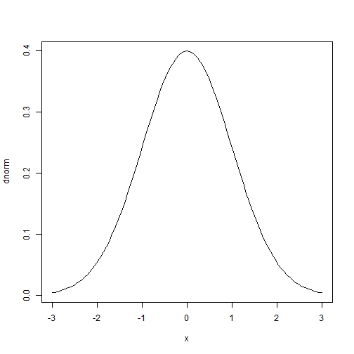

Advanced Statistics
========================================================
author: Bernhard Angele
date: Class 1 (supplement), October 2, 2014


R commands and functions used so far
========================================================
- Distribution functions
  - Get an overview of all of them by typing `?Distributions` at the command prompt
  - The function names follow a common pattern, where `xxx` stands for the abbreviated name of the distribution
    - Probability density function (PDF): `dxxx`, e.g. `dnorm`
    - Cumulative probability function (CDF) = area under the curve: `pxxx`, e.g. `pnorm`
    - Quantile function (allows you to specify the area under the curve and gives you the corresponding x value) = area under the curve: `pxxx`, e.g. `rnorm`
    - Random generator (generates random samples from the distribution): `rxxx`, e.g. `rnorm`

Using distribution functions
========================================================
- Examples
  - Generate 4 numbers from a normal distribution with mean = 10 and sd  = 5
  
  ```r
  rnorm(n = 4, mean = 10, sd = 5)
  ```
  
  ```
  [1]  8.78 16.94  8.83  9.68
  ```
  - What's the probability of getting a value greater or equal to 22 from that distribution?
  
  ```r
  1 - pnorm(22, mean = 10, sd = 5)
  ```
  
  ```
  [1] 0.008198
  ```

Using distribution functions
========================================================
- More examples
  - What x value is greater or equal to 95% of the samples from that distribution (mean = 10, sd = 5)?
  
  ```r
  qnorm(.95, mean = 10, sd = 5)
  ```
  
  ```
  [1] 18.22
  ```
  - Draw the curve of that distribution:
  
  ```r
  curve(dnorm(x, mean = 10, sd = 5), from = 6, to = 14)
  ```
  
   

More R techniques used so far
=======================================================
- Calling functions with arguments
  - Most functions will expect some kind of input
    - e.g. `mean` expects a vector of numbers
    
    ```r
    my_data <- c(23,6,78,4,3,2)
    mean(x = my_data)
    ```
    
    ```
    [1] 19.33
    ```
  - You do not have to call the arguments by name:
    
    ```r
    my_data <- c(23,6,78,4,3,2)
    mean(my_data)
    ```
    
    ```
    [1] 19.33
    ```
    
Function arguments
=======================================================    
- If you do not name the arguments of a function, they will be interpreted in the order that they are specified in the help file for the function (which you can get like this: `?rnorm`):
  - e.g. `rnorm` expects the arguments `n`, `mean`, and `sd`

```r
  rnorm(n = 5, mean = 10, sd = 2)
```

```
[1] 11.675 10.105  8.583 13.149  7.862
```

```r
  rnorm(5,10,2)
```

```
[1] 11.468 10.503 12.207  8.903  9.733
```
- Specifying non-existent arguments will give you an error.

Default arguments
=======================================================
- Some arguments have default values
  - You can find those out in the help file. For example, `rnorm` has `mean = 0` and `sd = 1` (the standard normal distribution). This can save you a lot of typing:
  
  ```r
  rnorm(n = 3, mean = 0, sd = 1)
  ```
  
  ```
  [1] -0.3900  0.1366  0.5483
  ```
  
  ```r
  rnorm(3)
  ```
  
  ```
  [1]  0.81367  0.05892 -0.32461
  ```
  - Not all arguments have default values. Not specifying arguments without default values will give you an error.
  
More R techniques used so far (2)
=======================================================  
- Nesting functions
  - You can run a function on the output of another function.
  - Example: Get the mean of a random sample of 100 from the standard normal distribution.
  
  ```r
  mean(rnorm(100))
  ```
  
  ```
  [1] -0.1973
  ```

Defining functions
=======================================================
- You can define as many new functions as you like
- This capability is extremely powerful and can save you a lot of typing
- Example: Make a function that prints "Hello World"
  
  ```r
  hello <- function() {
    print("Hello World")
    }
  hello()
  ```
  
  ```
  [1] "Hello World"
  ```

Defining functions (2)
=======================================================
- You can set your own arguments and default values
- Example: Make a function that generates `n` numbers from a normal distribution, then gives you the mean.
  
  ```r
  rnorm_mean <- function(n, mean = 0, sd = 1) {
    mean(rnorm(n, mean, sd))
    }
  rnorm_mean(n = 100, mean = 0, sd = 1)
  ```
  
  ```
  [1] -0.05342
  ```
  
  ```r
  rnorm_mean(5, 2, 1)
  ```
  
  ```
  [1] 2.261
  ```

Defining functions (3)
=======================================================
- The value (output) of a function is the value of the expression last evaluated in the function.
  
  ```r
  my_function <- function() {
    1
    2
    3
    }
  my_function()
  ```
  
  ```
  [1] 3
  ```
  
Defining functions (3)
=======================================================
- Or you can make the output explicit by using `return`
  
  ```r
  my_function <- function() {
    return(3)
    }
  my_function()
  ```
  
  ```
  [1] 3
  ```
  
Repeating things (important for simulations!)
=======================================================
- Several different ways
  - `for` loops:

```r
for(i in 1:5){
  print("Meow")
  }
```

```
[1] "Meow"
[1] "Meow"
[1] "Meow"
[1] "Meow"
[1] "Meow"
```

Repeating things (2)
=======================================================
`replicate` function:

```r
replicate(5, print("Meow"))
```

```
[1] "Meow"
[1] "Meow"
[1] "Meow"
[1] "Meow"
[1] "Meow"
```

```
[1] "Meow" "Meow" "Meow" "Meow" "Meow"
```

A more realistic application of replicate
=======================================================

```r
rnorm_mean <- function(n, mean = 0, sd = 1) {
  mean(rnorm(n, mean, sd))
  }
replicate(5, rnorm_mean(20))
```

```
[1] -0.3596  0.2504  0.1505 -0.1677  0.4221
```

```r
replicate(5, rnorm_mean(2000))
```

```
[1]  0.015135  0.020160 -0.029688  0.009442 -0.005174
```

Finally: plotting
======================================================
- For a quick overview of what's going on with your data, the standard `plot` command is quite good
- Let's try to plot two samples from a normal distribution against each other

```r
    plot(x = rnorm(100), y = rnorm(100))
```

 

Plotting mathematical functions
======================================================

```r
 plot(dnorm, from = -3, to = 3)
```

 
