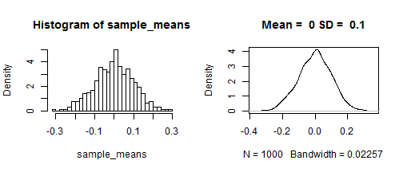
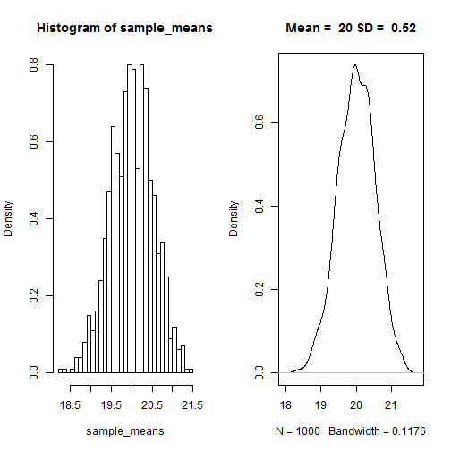
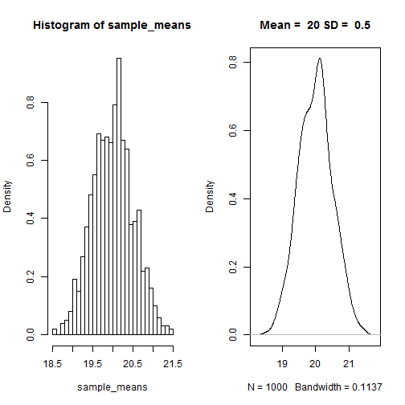
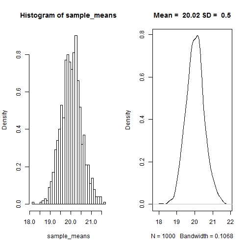
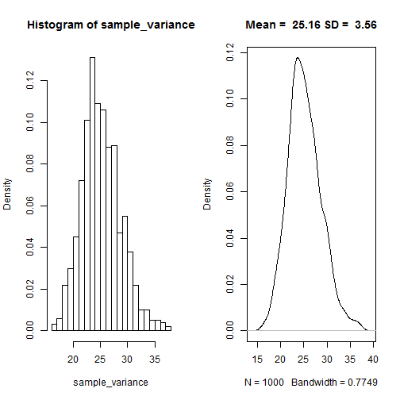
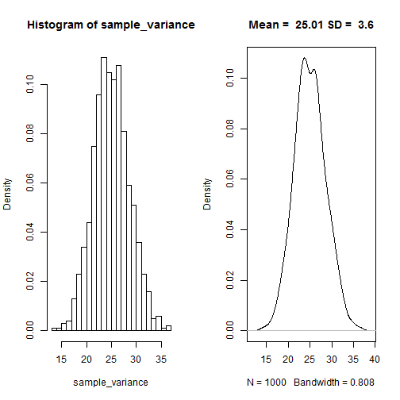
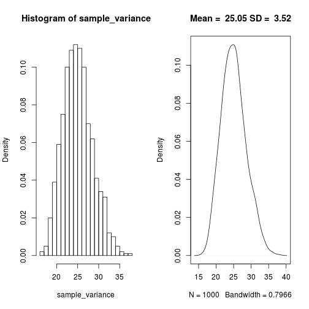
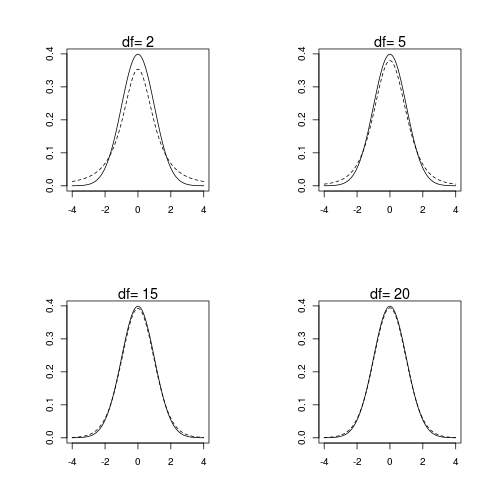

Advanced Statistics
========================================================
author: Bernhard Angele 
date: Class 2, October 9, 2014

Recap
========================================================
- Last week, we talked a lot about sampling from different probability distribution.
- We also talked about the properties of the distribution of sample means (hint: it's always roughly normal).
- Now what can we do with this knowledge? Remember the convenience function we wrote last time:

```r
run_simulation <- function(sample_size = 100, number_of_simulations = 1000, population_mean = 0, population_sd = 1)
  {

sample_means <- replicate(number_of_simulations, mean(rnorm(n = sample_size, mean = population_mean, sd = population_sd)))
}
```

Recap (2)
========================================================
- Remember our function for plotting these distributions:

```r
make_hist_and_plot <- function(sample_means){
  par(mfrow=c(1,2)) # 
  hist(sample_means,freq=F, breaks = 30)
  plot(density(sample_means), main = paste("Mean = ", round(mean(sample_means),2) , "SD = ", round(sd(sample_means),2)))} 
make_hist_and_plot(run_simulation(100,1000,0,1))
```

 

What changes when we re-run the simulation?
========================================================

```r
make_hist_and_plot(run_simulation(100,1000,20,5))
```

 

What changes when we re-run the simulation?
========================================================

```r
make_hist_and_plot(run_simulation(100,1000,20,5))
```

 

What changes when we re-run the simulation?
========================================================

```r
make_hist_and_plot(run_simulation(100,1000,20,5))
```

 

What changes when we re-run the simulation?
========================================================
It turns out the mean of the distribution of sample means varies around the population mean. The sd also varies, but a lot less. It varies around
$$
\begin{equation} \label{sigmabar}
\sigma_{\bar{x}} = \frac{\sigma}{\sqrt{n}}
\end{equation}
$$
So, to sum up:
The distribution of sample means is (roughly) normal, with $\mu_{\bar{x}} = \mu$ and $\sigma_{\bar{x}} = \frac{\sigma}{\sqrt{n}}$.
This means we can apply some of our knowledge about the normal distribution!

Confidence intervals
=========================================================
- If the distribution of sample means is normal, that means we can say something about the relationship between sample mean and population mean.
- Let's say the population mean $\mu$ is 3 and the population sd $\sigma$ is 1.
- What is the sample mean going to be?
- Think: what is the answer to this going to look like?
  - $\mu_{\bar{x}}$ is a random variable, so it doesn't make sense to give a point estimate
  - Instead, we can give an interval.
  - Do you remember the function for that?
    - That's right, it's `qnorm`.
    
Confidence intervals (2)
=========================================================
- So, let's get the interval that $\mu_{\bar{x}}$ is going to be in 95% of the time.
- We want something like this:
 

Confidence intervals (3)
=========================================================
- Let's start with the standard normal distribution
- We want to get an interval that includes 95% of the area under the curve
  - That means we need to take off 2.5% on every side
  - For the left interval boundary, we want the x value that is greater than or equal to 2.5% of x values

```r
qnorm(.025)
```

```
[1] -1.96
```

Confidence intervals (4)
=========================================================
- For the right interval boundary, we want the x value that is greater than or equal to 97.5% of x values

```r
qnorm(.975)
```

```
[1] 1.96
```
- If you've done statistics before, these numbers should be pretty familiar to you.
- Generalising this to other normal distributions is easy:
$\bar{x} = \mu \pm 1.96 \times \sigma_{\bar{x}}$
- Replacing $\sigma_{\bar{x}}$ with the expression based on the population SD:
$\bar{x} = \mu \pm 1.96 \times \frac{\sigma}{\sqrt{n}}$

Now reverse the idea
=========================================================
- Usually, we have no other information about a population but the sample we just collected.
- For example, let's say the sample mean is 3 and the sample SD is 1. Apart from this, we know nothing about the population.
- Can we compute a CI for the sample mean?
- Sure enough we can, but it gets a little more complicated.
  - (who would have thought?)

Computing a CI from the sample mean
==========================================================
- We'll have to estimate both the population mean and the population variance.
  - We have already estabished that the sample mean is a good estimator for the population mean.
- What about the sample sd ($s$)? Is it a good estimator for the population sd ($\sigma$)?
- Or the equivalent question: is sample variance ($s^2$) a good estimator of population variance ($\sigma^2$)?
- This sounds like really tricky maths problem.
  - But we can take it easy and just simulate!
  
Set up a function to simulate sampling and calculate sample variances
===========================================================

```r
run_variance_simulation <- function(sample_size = 100, number_of_simulations = 1000, population_mean = 0, population_sd = 1)
  {

sample_variances <- replicate(number_of_simulations, var(rnorm(n = sample_size, mean = population_mean, sd = population_sd)))
}
```

Define a new plot function so that the plot titles are correct
===========================================================

```r
make_variance_hist_and_plot <- function(sample_variance){
  par(mfrow=c(1,2)) # 
  hist(sample_variance,freq=F, breaks = 30)
  plot(density(sample_variance), main = paste("Mean = ", round(mean(sample_variance),2) , "SD = ", round(sd(sample_variance),2)))} 
```

Population variance and sample variance: plots
===========================================================

```r
make_variance_hist_and_plot(run_variance_simulation(100,1000,20,5))
```

 

Population variance and sample variance: plots
===========================================================

```r
make_variance_hist_and_plot(run_variance_simulation(100,1000,20,5))
```

 

Population variance and sample variance: plots
===========================================================

```r
make_variance_hist_and_plot(run_variance_simulation(100,1000,20,5))
```

 

Sample variance as an estimator of population variance
===========================================================
- Looks like it's a pretty good estimator (unbiased actually)
- We can plug the sd of the sample into the equation for the SD of the sampling distribution (or rather, the standard error):
$$
\begin{equation}
SE_{\bar{x}} = \frac{s}{\sqrt{n}}
\end{equation}
$$
(Note that we are ignoring the question if the relationship between $s$ and $s^2$ is the same as the relationship between $\sigma$ and $\sigma^2$. Feel free to simulate that.)
- But this means that our SE is an estimate of an estimate (estimating $\sigma$ from $s$, then estimating $SE_{\bar{x}}$).
- This means that our estimate for $\sigma$ is going to vary. Its accuracy will depend on the sample size.

Dealing with the uncertainty in s
============================================================
- We need a way to account for $s$ being less accurate at low sample sizes.
- Solution: assume that the sample means aren't normally distributed, but rather *t*-distributed
- Why *t*?
  - The *t*-distribution is like the standard normal distribution, but it has an additional parameter that we call df (for degrees of freedom, but don't worry about that yet).
  - The higher df, the closer the *t*-distribution is to the standard normal distribution
  - For lower df, the *t*-distribution has "heavy tails", meaning that it's wider
    - This reflects greater uncertainty.

See for yourselves
============================================================
Solid = normal distribution, dashed = *t*-distribution
 

Let's try this
==========================================================
- Using the *t*-distribution can compute CIs from samples as follows: get the lower and upper bounds (depending on sample size, e.g. 10):

```r
  n <- 10
  qt(.025, df = n - 1)
```

```
[1] -2.262
```

```r
  qt(.975, df = n - 1)
```

```
[1] 2.262
```
Why $n-1$? Don't worry about it unless you really love statistics.

Computing CIs
==========================================================
- Then take the upper and lower bounds and compute the CIs as follows:
$\bar{x} = \mu_{\bar{x}} \pm 2.262 \times \frac{s}{\sqrt{n}}$
- Remember we estimated $\mu_{\bar{x}}$ using the sample mean


```r
  sample_mean <- 3
  sample_sd <- 1
  (lower_bound <- sample_mean + qt(.025, df = n - 1)*sample_sd)
```

```
[1] 0.7378
```

```r
  (upper_bound <- sample_mean + qt(.975, df = n - 1)*sample_sd)
```

```
[1] 5.262
```
Why $n-1$? Don't worry about it unless you really love statistics.

There's a function for that
===========================================================

```r
sample_means <- rnorm(n = 10, mean = 3, sd = 1)
t.test(sample_means)
```

```

	One Sample t-test

data:  sample_means
t = 10.43, df = 9, p-value = 2.514e-06
alternative hypothesis: true mean is not equal to 0
95 percent confidence interval:
 2.325 3.612
sample estimates:
mean of x 
    2.968 
```

What does the CI of the sample mean mean? (sorry)
===========================================================
- Remember, we are reversing the idea that the 95% confidence interval around the population mean will have a 95% chance of containing the sample mean.
- This **DOES NOT MEAN** that we are 95% confident that the population mean is in within this 95% CI.
- Rather, it means that if you take a lot of samples and compute the CI around the sample mean, 95% of those CIs will contain the true population mean.
- This is a subtle, but important distinction.
- (In Bayesian statistics, you can actually get something equivalent to the first definition.)

