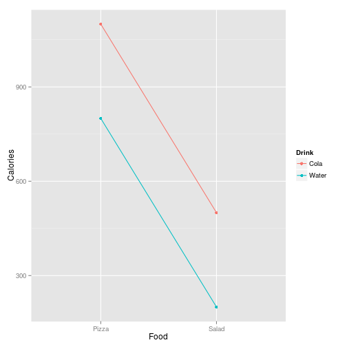
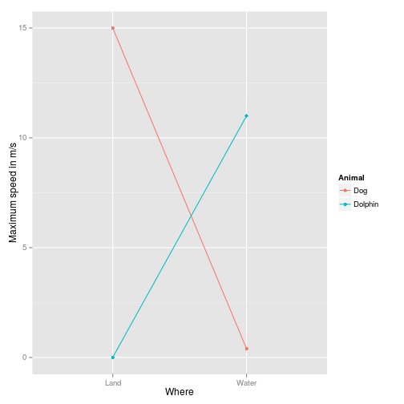
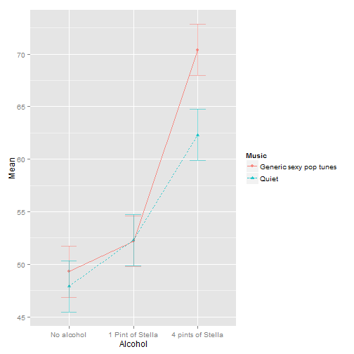
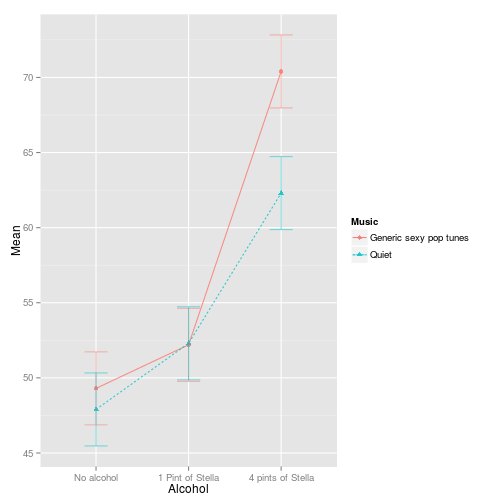

Advanced Statistics
========================================================
author: Bernhard Angele
date: Class 4, 23/10/2014

Multiway ANOVA
=========================================================
- What if we have two independent variables, $A$ and $B$?
- We can then split the total variance (or, equivalently, the sums of squares) four ways:
  - $SS_{Total} = SS_{A} + SS_{B} + SS_{A \times B} + SS_{Error}$
  - Each of these terms has degrees of freedom: $df_{Total} = df_A + df_B + df_{A \times B} + df_{Error}$
  - For each term, you can compute mean squares and F values, e.g. $F_A = \frac{MS_A}{MS_{Error}}$
  - What is $SS_{A \times B}$? It's the **interaction** between A and B
    - A *main effect* (A or B) is a difference between means
    - An *interaction* is a difference between differences

Multiway ANOVA (2)
==========================================================
- How to compute the dfs:
    - For main effects, just like in the oneway ANOVA: $df_A = k_{A} - 1$, where $k_A$ is the number of groups or *levels* of that variable
    - For interactions, it's the product of the dfs of the corresponding main effects:
      - $df_{A \times B} = df_A \cdot df_B$
    - Just as a reminder: $df_{Total}$ is still $N - 1$, where $N$ is the total number of subjects or observations in your study (across all variables)
    - And as before, if you subtract all the other dfs from $df_{Total}$, you get $df_{Error}$ 
    - $df_{Error} = df_{Total} - df_A - df_B - df_{A \times B}$ 

Interactions
==========================================================
- Main effects are additive
- For example:


|Food  |Drink | Calories|
|:-----|:-----|--------:|
|Pizza |Water |      800|
|Pizza |Cola  |     1100|
|Salad |Water |      200|
|Salad |Cola  |      500|

Additive effects
=========================================================
 

Non-additive effects
==========================================================
- Example: Animal and maximum movement speed (meters/s) on land and in water


|Where |Animal  | Speed|
|:-----|:-------|-----:|
|Land  |Dog     |  15.0|
|Land  |Dolphin |   0.0|
|Water |Dog     |   0.4|
|Water |Dolphin |  11.0|

Non-additive effects (2)
==========================================================
 
- Crossover interaction

Marginal effects
==========================================================
- In the presence of a significant interaction, main effects are much harder to interpret
  - Better to call them marginal effects (although few people do, even in publications!)
- What does it mean that the marginal speed of a dolphin is 7.5 m/s (when averaging over the water and land conditions)?
  - Not much! The mean is nearly meaningless here...
  
Marginal effects (2)
=========================================================
- In some cases, you will still be interested in the marginal effects
  - For example, your anxiety treatment might differ in its effectiveness for male and female participants, but the marginal effects show that overall, everyone benefits from it at least a little.
  - Of course, if males get a little more anxious and females get a lot less anxious (a crossover interaction), the positive marginal effect still doesn't mean you should give males this interaction!
  
How to do a multiway ANOVA
==========================================================
- Example data: Attractiveness, music, and alcohol

```r
attract <- read.csv("attract.csv")
# by default, R will sort factor levels alphabetically
# the following line will make "No alcohol" the baseline level
attract$Alcohol <- relevel(attract$Alcohol, ref = "No alcohol")

attract$subject <- 1:nrow(attract)
```

Make a table
=========================================================
- Note the way you specify multiple between subject factors by using `.(Music, Alcohol)pair

```r
library(ez)
library(knitr)
attract_stats <- ezStats(data = attract, dv = Attractiveness.Rating, wid = subject, between = .(Music, Alcohol))
kable(attract_stats)
```


|Music                  |Alcohol           |  N| Mean|   SD| FLSD|
|:----------------------|:-----------------|--:|----:|----:|----:|
|Generic sexy pop tunes |No alcohol        | 10| 49.3| 5.50| 4.86|
|Generic sexy pop tunes |1 Pint of Stella  | 10| 52.2| 5.88| 4.86|
|Generic sexy pop tunes |4 pints of Stella | 10| 70.4| 5.04| 4.86|
|Quiet                  |No alcohol        | 10| 47.9| 4.91| 4.86|
|Quiet                  |1 Pint of Stella  | 10| 52.3| 5.77| 4.86|
|Quiet                  |4 pints of Stella | 10| 62.3| 5.36| 4.86|

Plot it
==========================================================
- Line plots are OK when you're plotting an interaction.
- Always put the variable with the most levels on the x-axis.

```r
ezPlot(data = attract, dv = Attractiveness.Rating, wid = subject, between = .(Music, Alcohol), x = Alcohol, split = Music)
```

 

Do the ANOVA
===========================================================

```r
(attract_anova <- ezANOVA(data = attract, dv = Attractiveness.Rating, wid = subject, between = .(Music, Alcohol)))
```

```
$ANOVA
         Effect DFn DFd     F        p p<.05    ges
1         Music   1  54  5.01 2.93e-02     * 0.0849
2       Alcohol   2  54 59.79 2.03e-14     * 0.6889
3 Music:Alcohol   2  54  3.24 4.68e-02     * 0.1072

$`Levene's Test for Homogeneity of Variance`
  DFn DFd SSn SSd     F     p p<.05
1   5  54 5.8 412 0.152 0.979      
```
- All three terms are significant.
- No homogeneity of variance issues

Pairwise comparisons
============================================================
- Easiest way: Use Tukey's HSD

```r
# We need to re-run ezANOVA and tell it to give us the aov object 
# (I'll explain what an aov object is next week)
attract_anova <- ezANOVA(data = attract, dv = Attractiveness.Rating, wid = subject, between = .(Music, Alcohol), return_aov = TRUE)
attract_tukey <- TukeyHSD(x = attract_anova$aov)
```

Tukey's HSD
============================================================
- Computes all possible comparisons
- Lots of output. Let's look at the main effects first.
  - Music:

```r
attract_tukey$Music
```

```
                              diff   lwr    upr  p adj
Quiet-Generic sexy pop tunes -3.13 -5.94 -0.327 0.0293
```
- Technically, we didn't need this one, since there were only two Music conditions.
- Note that the p-value for the comparison is *exactly* the same as in the F-test.
- The two tests are completely equivalent (no $\alpha$ correction applied here, since there are only two levels)

Tukey's HSD (2)
==============================================================
- Alcohol

```r
kable(attract_tukey$Alcohol)
```

```


|                                   |   diff|    lwr|    upr| p adj|
|:----------------------------------|------:|------:|------:|-----:|
|1 Pint of Stella-No alcohol        |  3.650| -0.482|  7.782| 0.093|
|4 pints of Stella-No alcohol       | 17.750| 13.618| 21.882| 0.000|
|4 pints of Stella-1 Pint of Stella | 14.100|  9.968| 18.232| 0.000|
```
- The "No alcohol" vs. "1 pint" comparison is not significant

Interaction effects
==============================================================

```r
kable(attract_tukey$"Music:Alcohol")
```


|                                                                                 |   diff|     lwr|    upr| p adj|
|:--------------------------------------------------------------------------------|------:|-------:|------:|-----:|
|Quiet:No alcohol-Generic sexy pop tunes:No alcohol                               | -1.400|  -8.563|  5.763| 0.992|
|Generic sexy pop tunes:1 Pint of Stella-Generic sexy pop tunes:No alcohol        |  2.900|  -4.263| 10.063| 0.837|
|Quiet:1 Pint of Stella-Generic sexy pop tunes:No alcohol                         |  3.000|  -4.163| 10.163| 0.817|
|Generic sexy pop tunes:4 pints of Stella-Generic sexy pop tunes:No alcohol       | 21.100|  13.937| 28.263| 0.000|
|Quiet:4 pints of Stella-Generic sexy pop tunes:No alcohol                        | 13.000|   5.837| 20.163| 0.000|
|Generic sexy pop tunes:1 Pint of Stella-Quiet:No alcohol                         |  4.300|  -2.863| 11.463| 0.491|
|Quiet:1 Pint of Stella-Quiet:No alcohol                                          |  4.400|  -2.763| 11.563| 0.465|
|Generic sexy pop tunes:4 pints of Stella-Quiet:No alcohol                        | 22.500|  15.337| 29.663| 0.000|
|Quiet:4 pints of Stella-Quiet:No alcohol                                         | 14.400|   7.237| 21.563| 0.000|
|Quiet:1 Pint of Stella-Generic sexy pop tunes:1 Pint of Stella                   |  0.100|  -7.063|  7.263| 1.000|
|Generic sexy pop tunes:4 pints of Stella-Generic sexy pop tunes:1 Pint of Stella | 18.200|  11.037| 25.363| 0.000|
|Quiet:4 pints of Stella-Generic sexy pop tunes:1 Pint of Stella                  | 10.100|   2.937| 17.263| 0.002|
|Generic sexy pop tunes:4 pints of Stella-Quiet:1 Pint of Stella                  | 18.100|  10.937| 25.263| 0.000|
|Quiet:4 pints of Stella-Quiet:1 Pint of Stella                                   | 10.000|   2.837| 17.163| 0.002|
|Quiet:4 pints of Stella-Generic sexy pop tunes:4 pints of Stella                 | -8.100| -15.263| -0.937| 0.018|

Interaction effects (2)
==============================================================
- That's a lot! We're mostly interested in the differences between differences.
  - Is the effect of music significant at each level of alcohol?
- No alcohol:

```r
attract_tukey$"Music:Alcohol"["Quiet:No alcohol-Generic sexy pop tunes:No alcohol",]
```

```
  diff    lwr    upr  p adj 
-1.400 -8.563  5.763  0.992 
```
- 1 pint:

```r
attract_tukey$"Music:Alcohol"["Quiet:1 Pint of Stella-Generic sexy pop tunes:1 Pint of Stella",]
```

```
 diff   lwr   upr p adj 
 0.10 -7.06  7.26  1.00 
```
- 4 pints:

```r
attract_tukey$"Music:Alcohol"["Quiet:4 pints of Stella-Generic sexy pop tunes:4 pints of Stella",]
```

```
   diff     lwr     upr   p adj 
 -8.100 -15.263  -0.937   0.018 
```

Interaction effects (3)
==============================================================
- OK, finding the correct lines was a bit of work
  - But it's not much better in SPSS, either!
    - I will show you a better way next week.
- Summary:
  - No music effect at no alcohol
  - No music effect at 1 pint
  - Music effect at 4 pints
- This is the interaction: the 3 alcohol levels differ with regard to the difference between the music and the no music levels

Look at the plot again
==========================================================

```r
ezPlot(data = attract, dv = Attractiveness.Rating, wid = subject, between = .(Music, Alcohol), x = Alcohol, split = Music)
```

 

Finally, assumption tests
==========================================================
- We already checked the homogeneity of variance assumption
- Let's run the Shapiro-Wilk test on the residuals

```r
shapiro.test(resid(attract_anova$aov))
```

```

	Shapiro-Wilk normality test

data:  resid(attract_anova$aov)
W = 0.953, p-value = 0.02101
```
- Some deviations from normality
  - Fun fact: This is not clear from the SPSS output! (I wouldn't blame you for assuming normality if you used SPSS here)
- Probably not a big problem since we have a balanced design, but still good to mention

Writing it up
============================================================
A 2-factor (2x3) independent samples ANOVA was conducted where the first factor represents music exposure (quiet and music) and the second factor represents alcohol condition (no alcohol, 1-pint, and 4-pints). While the Shapiro-Wilk test showed that there was a slight deviation from normality (p = .02), there was no evidence for a violation of the homogeneity of variance assumption. Overall, the ANOVA method should be robust to the slight deviation from normality that was observed. Attractiveness ratings were significantly higher with music exposure, F(1,54) = 5.01, *p* =.03, $\eta_G^2$ = .09. The main effect of alcohol was also significant, F(2,54) = 59.79, p<.001, $\eta_G^2$ = .69. A post hoc test (Tukey's HSD) indicated that participants who drank 4 pints of beer rated attractiveness as significantly higher than participants who had no alcohol (p < .001) and one pint (p < .001). There was no difference between the no alcohol and 1-pint groups (*p* =.11). 

Writing it up (2)
=============================================================
The music by alcohol interaction was also significant, F(2,54) = 3.24, p=.047, $\eta_G^2$ = .11. This indicates that alcohol had different effects under conditions of music exposure. Specifically, post-hoc comparisons showed that with no alcohol there was no difference in attractiveness ratings for music (M=49.30, SD=5.50) and no music (M=47.90, SD=4.91). Similarly, following 1-pint there was no difference in attractiveness ratings for music (M=52.20, SD=5.88) and no music (M=52.30, SD=5.77). However, following 4-pints attractiveness ratings were higher with music (M=70.40, SD=5.04) than without music (M=62.30, SD=5.36). This effect was significant (*p* =.018).

Repeated measures
=============================================================
- Remember the paired t-tests? We can have the same situation (more than one data point from one participant) in a more complex design.
- This is bad, because we violate the independence assumption in the standard ANOVA.
- This is good, because we can use a repeated-measures ANOVA to remove all between-participant variance
- $SS_{Total} = SS_{Between Participants} + SS_{Within Participants}$
- $SS_{Within_Participants} = SS_{Model} + SS_{Error}$
- Result: Less error variance and higher power!
- In the between-subjects ANOVA the variance between participants is completely confounded with the error variance within participants.
- In the repeated measures ANOVA, we can separate them!

Oneway repeated measures ANOVA
==============================================================
- Do you feel happier after certain life experiences?
- 20 subjects were asked to rate their happiness after certain typical life experiences
  - Doing nothing for a day
  - Climbing Mount Everest (!)
  - Going shopping
- Each subject had all three experiences and gave three ratings

```r
library(ez)
library(knitr)
# load the data
life <- read.csv("life.csv")
```

Life experiences and happiness
=============================================================
Make a table

```r
# add subject column
#
life_stats <- ezStats(data = life, dv = Happiness, wid = Subject, within = Experience)
kable(life_stats)
```


|Experience |  N| Mean|   SD| FLSD|
|:----------|--:|----:|----:|----:|
|Everest    | 20| 52.0| 10.4| 2.13|
|Nothing    | 20| 51.0| 11.0| 2.13|
|Shopping   | 20| 50.2| 10.2| 2.13|

Life experiences and happiness (2)
=============================================================
- Let's have ezANOVA do the ANOVA for us (just use `within` instead of `between` to tell it that you have a within-subjects effect)

```r
(life_anova <- ezANOVA(data = life, dv = Happiness, wid = Subject, within = Experience))
```

```
$ANOVA
      Effect DFn DFd   F     p p<.05     ges
2 Experience   2  38 1.4 0.259       0.00488

$`Mauchly's Test for Sphericity`
      Effect     W     p p<.05
2 Experience 0.993 0.938      

$`Sphericity Corrections`
      Effect   GGe p[GG] p[GG]<.05  HFe p[HF] p[HF]<.05
2 Experience 0.993 0.259           1.11 0.259          
```
What are these values?
=============================================================
- This one you know already: it's the ANOVA output:

|   |Effect     | DFn| DFd|   F|     p|p<.05 |   ges|
|:--|:----------|---:|---:|---:|-----:|:-----|-----:|
|2  |Experience |   2|  38| 1.4| 0.259|      | 0.005|
- This one is new: Mauchly's test for Sphericity

|   |Effect     |     W|     p|p<.05 |
|:--|:----------|-----:|-----:|:-----|
|2  |Experience | 0.993| 0.938|      |
- This one is, too: Sphericity corrections

|   |Effect     |   GGe| p[GG]|p[GG]<.05 |  HFe| p[HF]|p[HF]<.05 |
|:--|:----------|-----:|-----:|:---------|----:|-----:|:---------|
|2  |Experience | 0.993| 0.259|          | 1.11| 0.259|          |

What is sphericity?
==============================================================
- The variances of the differences between treatment levels should be roughly equal ("spherical")
- For example, it could be that everyone reacts similarly to doing nothing and going shopping
  - But an Everest climb might make some people very happy and some people very unhappy
- In that case, the difference between "Nothing" and "Shopping" would have a very low variance
  - But the difference between "Nothing" or "Shopping" and "Everest" would be huge
- This could make the ANOVA anticonservative ($\alpha$ is inflated)

Testing for sphericity violations
=================================================================
- Mauchly's Test for Sphericity

|   |Effect     |     W|     p|p<.05 |
|:--|:----------|-----:|-----:|:-----|
|2  |Experience | 0.993| 0.938|      |
- If it's significant, sphericity is violated.
- In this case, we're OK
- You only need to test sphericity if you have more than two factor levels (i.e. conditions in your factor)
- If you only have two levels, there is only one difference, so differences can't be unequal

Dealing with sphericity violations
==================================================================
- Good news: It's easy. 
- Essentially, you can lower your degrees of freedom for the F-test to compensate for lack of sphericity
  - The F-value doesn't change, but lowering the df will make it harder to get a low *p*-value
- You do this by multiplying the $df_{Model}$ and $df_{Error}$ with a correction factor $\epsilon$
- Two ways to calculate $\epsilon$:
  - Greenhouse-Geisser
  - Huynh-Feldt
- Recommendation: If Greenhouse-Geisser $\epsilon < .75$, use it. Otherwise, use Huynh-Feldt.
  - Of course, if Mauchly's test is not significant, use neither!
  
Dealing with sphericity violations (2)
==================================================================
- SPSS computes the dfs for you and you just have to pick the correct entry in the table
- ezANOVA makes it a *tiny* bit more difficult:

|   |Effect     |   GGe| p[GG]|p[GG]<.05 |  HFe| p[HF]|p[HF]<.05 |
|:--|:----------|-----:|-----:|:---------|----:|-----:|:---------|
|2  |Experience | 0.993| 0.259|          | 1.11| 0.259|          |
- It gives you the correction factors (`GGe` for Greenhouse-Geisser $\epsilon$ and `HFe` for Huynh-Feldt $\epsilon$) and the corresponding *p*-values, but not the corrected dfs themselves
- So you just have to do the multiplication yourself if you want to report the corrected dfs
- Important: If you use a correction method, report which one you used!

Testing for normality
===================================================================
- Computing residuals for repeated-measures ANOVAs is tricky
  - No residuals means we can't do the Shapiro-Wilk test on them
- SPSS gets around this by doing the Shapiro-Wilk test inside each factor level
  - This is problematic, too: small sample sizes reduce the power of the test
    - Normality violations might not be detected

Testing for normality (2)
===================================================================
- Other option: Simply test normality for the raw data

```r
  shapiro.test(life$Happiness)
```

```

	Shapiro-Wilk normality test

data:  life$Happiness
W = 0.985, p-value = 0.6886
```
- No issues here.
- This is not great, since we know the data aren't going to be perfectly normal if we think there is a systematic effect
  - Both ways are really equally bad...

Testing for normality (3)
===================================================================
- I'm fine if you do either normality test for the assignment.
- Normality isn't usually *much* of an issue, especially if your group sizes are equal
  - The **ANOVA is robust**
- There is actually a better way for doing all of this, but you have to wait until our last class to find out!


Post-hoc tests
===================================================================
- You can use `pairwise.t.test` to compare each condition
  - In this case, there is no signficant effect, but I'll do them anyway to demonstrate
  - Remember: in a repeated measures design, we have to use paired *t*-tests
    - use `paired = TRUE`

```r
pairwise.t.test(x = life$Happiness, g = life$Experience, paired = TRUE)
```

```

	Pairwise comparisons using paired t tests 

data:  life$Happiness and life$Experience 

         Everest Nothing
Nothing  0.63    -      
Shopping 0.34    0.63   

P value adjustment method: holm 
```

Mixed designs
===================================================================
- You can combine between-subject and within-subject factors in one ANOVA
- This is called a mixed ANOVA
- Hint: Your assignment will consist of doing and reporting a mixed ANOVA
- To practice this, let's do Homework 4 together.
