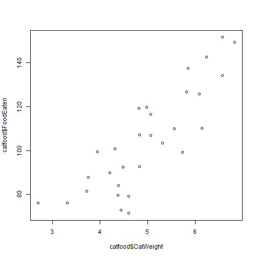
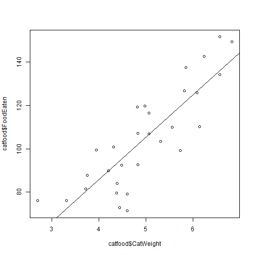

Advanced Statistics
========================================================
author: Bernhard Angele
date: Class 5, 30/10/2014

Linear regression
========================================================
- So far, we've figured out how to test if a *discrete* predictor (e.g. treatment group) can explain the variance in a *continuous* variable.
- What if our predictor is also *continuous*?

- Example:
    - More exciting data about cats and cat food!
    - Is the amount of cat food a cat eats related to its weight?
    
Cat food and weight
=========================================================


- This table actually has 30 rows, but I'm using the `head` command to just show you the first 6.
- You have cat weight in kg and cat food eaten in g.
- Looks like there might be a positive relationship here.


```r
kable(head(catfood))
```


| CatWeight| FoodEaten|
|---------:|---------:|
|     4.378|     79.56|
|     6.820|    149.40|
|     5.552|    109.90|
|     5.723|     99.19|
|     4.386|     83.99|
|     4.489|     92.39|

Let's plot it
==========================================================

```r
plot(x = catfood$CatWeight, y = catfood$FoodEaten)
```

 

Looks quite linear
==========================================================
- Let's put a line through it

```r
plot(x = catfood$CatWeight, y = catfood$FoodEaten)
abline(lm(catfood$FoodEaten ~ catfood$CatWeight))
```

 

Correlation
==========================================================
- Looks like we have a strong positive relationship:
    - The heavier the cat (variable $X$), the more food eaten (variable $Y$).
- We can compute the correlation coefficient
  - The correlation is the covariance ($\sigma{(X_i - \bar{X})\cdot(Y_i - \bar{Y})}$, where $X_i$ and $Y_i$ are each individual value in the two variables and $\bar{X}$ and $\bar{Y}$ are the means) which we standardise by dividing it by the product of the standard deviations ($s_X \cdot s_Y$).
  - Or we can just have R do it for us:

```r
cor(catfood$CatWeight, catfood$FoodEaten)
```

```
[1] 0.8406
```

Testing correlations
==========================================================
- Important: correlations calculated from a sample are **random variables**
- That means they will be different each time we repeat the experiment and whether they reflect the true correlation in the population depends on our luck of the draw.
- Luckily, Pearson figured out that if you randomly take *uncorrelated* samples from a normal distribution and compute the correlation coefficient, it will be *t*-distributed.
    - Tthis is exactly what you are doing if the null hypothesis that there is no relationship between the two variables you are studying is true.
    - So all we have to do is to see if the correlation coefficient is extreme enough that it would only occur 5% of the time or less if the $H_0$ (no correlation in the population) were true.

Testing correlations (2)
==========================================================
- R can do this *t*-test very easily using the `cor.test` function:

```r
cor.test(catfood$CatWeight, catfood$FoodEaten)
```

```

	Pearson's product-moment correlation

data:  catfood$CatWeight and catfood$FoodEaten
t = 8.213, df = 28, p-value = 6.119e-09
alternative hypothesis: true correlation is not equal to 0
95 percent confidence interval:
 0.6891 0.9218
sample estimates:
   cor 
0.8406 
```

Moving beyond correlations
============================================================
- So far, so good. But what if we have multiple continuous predictors?
- Let's look at the function we used to draw the line again:

```r
abline(lm(catfood$FoodEaten ~ catfood$CatWeight))
```
- The `abline` part just does the drawing. The real work is done by `lm`.
- `lm` stands for "Linear Models"
- Let's see what `lm` does if we don't use `abline` on it

Linear models
===========================================================
- Remember the formula interface? It's `Dependent variable ~ Independent variable(s)`
- Also, I can use `data = catfood` to avoid having to write `catfood$` every time.

```r
lm(formula = FoodEaten ~ CatWeight, data = catfood)
```

```

Call:
lm(formula = FoodEaten ~ CatWeight, data = catfood)

Coefficients:
(Intercept)    CatWeight  
       7.72        19.54  
```

What do these values mean?
============================================================
- `lm` tries to fit a *least squares* line through the data
- That means that it fits a line that minimises the square of each data point's deviation from the line
- *Least squares* means that large errors are penalised much more than small errors
- If you remember algebra from school, the function that draws a line has the following format:
    - $y = a + b \cdot x$
    - $a$ is called the *intercept*, since it gives the $y$-value where the line intersects the $y$-axis
    - $b$ is called the *slope*. For each unit of $x, $y$ changes this many units
    
What do these values mean (2)?
============================================================
- So, in our case, the best fitting line for the cat food data intersects the $y$-axis at the point (0, 7.7176).
  - Not all x-values are sensible for all data. Saying that a cat with 0 kg weight would eat 7.7176 g of food makes no sense, since a cat with 0 kg weight is not a cat anymore.
  - The linear function doesn't care, of course. It knows nothing about our data and just specifies a line.
- The slope might be more useful: It says that for each kg of extra weight, a cat will eat 19.536 more grammes of food.
    - Using this information, we can predict that a giant 8 kg cat would eat $7.7176 + 19.536 \cdot 8 = 164.0055$ g of food.
    
Predictions and residual errors
===============================================================
- Of course, our prediction is likely to be at least a little off.
- If we had an 8 kg cat in our data and its actual amount of food consumed was 170 g, we'd have an error of 5.9945.
  - This is called the residual error.
- More formally, the regression equation looks like this (where $x_i$ are the individual values for the $x$ variable, and $y_i$ are the corresponding values for the $Y$ variable):
    - $y_i = \beta_0 + \beta_1 x_i + \epsilon_i$
    - Here, we've simply renamed the intercept to $\beta_0$ and the slope to $\beta_1$.
    - $\epsilon_i$ is the residual error for each data point.
    - Important: $\epsilon_i$ is assumed to be normally distributed
      - This doesn't matter for the line fitting, but it does for the hypothesis tests!
      
Back to hypothesis testing
=================================================================
- Important: Note that the $\beta$ variables are greek letters, which means they are the *population parameters*
- For each $\beta$ in the regression formula, we can propose the $H_0$ that its true value is 0
- The $\beta$ that are estimated from our sample are simply called $b$
- We can once again test if our $b$ values are extreme enough so they would only occur 5% of the time or less given the $H_0$.
- We test this separately for each $b$ value. Guess what, it's a *t*-test!

Hypothesis testing using lm
=================================================================
- In R, the `summary` function will usually give us the hypothesis tests corresponding to a linear model:

```r
summary(lm(formula = FoodEaten ~ CatWeight, data = catfood))
```

```

Call:
lm(formula = FoodEaten ~ CatWeight, data = catfood)

Residuals:
    Min      1Q  Median      3Q     Max 
-26.294  -9.010   0.698   9.634  17.570 

Coefficients:
            Estimate Std. Error t value Pr(>|t|)    
(Intercept)     7.72      12.06    0.64     0.53    
CatWeight      19.54       2.38    8.21  6.1e-09 ***
---
Signif. codes:  0 '***' 0.001 '**' 0.01 '*' 0.05 '.' 0.1 ' ' 1

Residual standard error: 13 on 28 degrees of freedom
Multiple R-squared:  0.707,	Adjusted R-squared:  0.696 
F-statistic: 67.5 on 1 and 28 DF,  p-value: 6.12e-09
```
