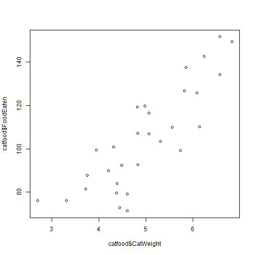
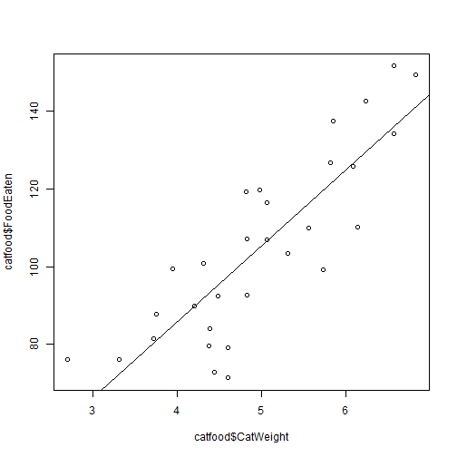
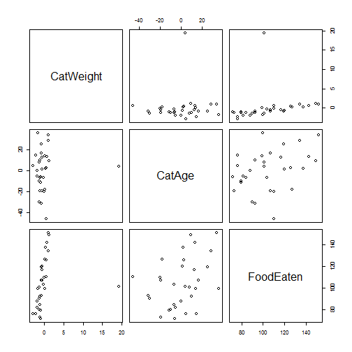

Advanced Statistics
========================================================
author: Bernhard Angele
date: Class 5, 30/10/2014

Linear regression
========================================================
- So far, we've figured out how to test if a *discrete* predictor (e.g. treatment group) can explain the variance in a *continuous* variable.
- What if our predictor is also *continuous*?

- Example:
    - More exciting data about cats and cat food!
    - Is the amount of cat food a cat eats related to its weight?
    - In other words, do fat cats eat more?
    
Cat food and weight
=========================================================


- This table actually has 30 rows, but I'm using the `head` command to just show you the first 6.
- You have cat weight in kg and cat food eaten in g.
- Looks like there might be a positive relationship here.


```r
kable(head(catfood))
```


| CatWeight| FoodEaten|
|---------:|---------:|
|      5.06|      86.6|
|      4.70|     104.5|
|      2.88|      80.6|
|      4.19|      81.0|
|      4.68|     109.0|
|      4.97|     116.4|

Let's plot it
==========================================================

```r
plot(x = catfood$CatWeight, y = catfood$FoodEaten)
```

 

Looks quite linear
==========================================================
- Let's put a line through it

```r
plot(x = catfood$CatWeight, y = catfood$FoodEaten)
abline(lm(catfood$FoodEaten ~ catfood$CatWeight))
```

 

Correlation
==========================================================
- Looks like we have a strong positive relationship:
    - The heavier the cat (variable $x$), the more food eaten (variable $y$).
- We can compute the correlation coefficient
  - The correlation $r$ is the covariance $s_{xy} = \frac{1}{n-1}\sum\limits_{i = 1}^n {(x_i - \bar{x})\cdot(y_i - \bar{y})}$, where $x_i$ and $y_i$ are each pair of individual values in the two variables and $\bar{x}$ and $\bar{y}$ are the means) which we standardise by dividing it by the product of the standard deviations ($s_x \cdot s_y$). In short, $r = \frac{s_{xy}}{s_x \cdot s_y}$.
  - Or we can just have R do it for us:

```r
cor(catfood$CatWeight, catfood$FoodEaten)
```

```
[1] 0.663
```

Correlation (2)
===========================================================
- If we square the correlation $r$, we get $R^2$, the proportion of variance in variable $X$ explained by variable $Y$ (and vice-versa, of course)

```r
cor(catfood$CatWeight, catfood$FoodEaten)^2
```

```
[1] 0.439
```


Testing correlations
==========================================================
- Important: correlations calculated from a sample are **random variables**
- That means they will be different each time we repeat the experiment and whether they reflect the true correlation in the population depends on our luck of the draw.
- Luckily, Pearson figured out that if you randomly take *uncorrelated* samples from a normal distribution and compute the correlation coefficient, it will be *t*-distributed.
    - Tthis is exactly what you are doing if the null hypothesis that there is no relationship between the two variables you are studying is true.
    - So all we have to do is to see if the correlation coefficient is extreme enough that it would only occur 5% of the time or less if the $H_0$ (no correlation in the population) were true.

Testing correlations (2)
==========================================================
- R can do this *t*-test very easily using the `cor.test` function:

```r
cor.test(catfood$CatWeight, catfood$FoodEaten)
```

```

	Pearson's product-moment correlation

data:  catfood$CatWeight and catfood$FoodEaten
t = 4.68, df = 28, p-value = 6.596e-05
alternative hypothesis: true correlation is not equal to 0
95 percent confidence interval:
 0.397 0.826
sample estimates:
  cor 
0.663 
```

Moving beyond correlations
============================================================
- So far, so good. But what if we have multiple continuous predictors?
- Let's look at the function we used to draw the line again:

```r
abline(lm(catfood$FoodEaten ~ catfood$CatWeight))
```
- The `abline` part just does the drawing. The real work is done by `lm`.
- `lm` stands for "Linear Models"
- Let's see what `lm` does if we don't use `abline` on it

Linear models
===========================================================
- Remember the formula interface? It's `Dependent variable ~ Independent variable(s)`
- Also, I can use `data = catfood` to avoid having to write `catfood$` every time.

```r
lm(formula = FoodEaten ~ CatWeight, data = catfood)
```

```

Call:
lm(formula = FoodEaten ~ CatWeight, data = catfood)

Coefficients:
(Intercept)    CatWeight  
       22.4         16.3  
```

What do these values mean?
============================================================
- `lm` tries to fit a *least squares* line through the data
- That means that it fits a line that minimises the square of each data point's deviation from the line
- *Least squares* means that large errors are penalised much more than small errors
- If you remember algebra from school, the function that draws a line has the following format:
    - $y = m \cdot x + c$
    - $c$ is called the *intercept*, since it gives the $y$-value where the line intersects the $y$-axis
    - $m$ is called the *slope*. For each unit of $x$, $y$ changes this many units
    - In regression, we usually write the intercept first ($c + m \cdot x$), but that's just a convention.
    
What do these values mean (2)?
============================================================
- So, in our case, the best fitting line for the cat food data intersects the $y$-axis at the point (0, 22.384).
  - Not all x-values are sensible for all data. Saying that a cat with 0 kg weight would eat 22.384 g of food makes no sense, since a cat with 0 kg weight is not a cat anymore.
  - The linear function doesn't care, of course. It knows nothing about our data and just specifies a line.
- The slope might be more useful: It says that for each kg of extra weight, a cat will eat 16.253 more grammes of food.
    - Using this information, we can predict that a giant 8 kg cat would eat $22.384 + 16.253 \cdot 8 = 152.412$ g of food.
    
Predictions and residual errors
===============================================================
- Of course, our prediction is likely to be at least a little off.
- If we had an 8 kg cat in our data and its actual amount of food consumed was 170 g, we'd have an error of 17.588.
  - This is called the residual error.
- More formally, the regression equation looks like this (where $x_i$ are the individual values for the $x$ variable, and $y_i$ are the corresponding values for the $Y$ variable):
    - $y_i = \beta_0 + \beta_1 x_i + \epsilon_i$
    - Here, we've simply renamed the intercept to $\beta_0$ and the slope to $\beta_1$.
    - $\epsilon_i$ is the residual error for each data point.
    - Important: $\epsilon_i$ is assumed to be normally distributed
      - This doesn't matter for the line fitting, but it does for the hypothesis tests!
      
Back to hypothesis testing
=================================================================
- Important: Note that the $\beta$ variables are greek letters, which means they are the *population parameters*
- For each $\beta$ coefficient in the regression formula, we can propose the $H_0$ that the true value of that $\beta$ coefficient is 0
- The $\beta$ that are estimated from our sample are simply called $b$
- We can once again test if our $b$ values are extreme enough so they would only occur 5% of the time or less given the $H_0$.
- We test this separately for each $b$ value. Guess what, it's a *t*-test!

Hypothesis testing using lm
=================================================================
- In R, the `summary` function will usually give us the hypothesis tests corresponding to a linear model:

```r
summary(lm(formula = FoodEaten ~ CatWeight, data = catfood))
```

```

Call:
lm(formula = FoodEaten ~ CatWeight, data = catfood)

Residuals:
   Min     1Q Median     3Q    Max 
-39.06 -10.43   0.41  12.82  30.08 

Coefficients:
            Estimate Std. Error t value Pr(>|t|)    
(Intercept)    22.38      16.84    1.33     0.19    
CatWeight      16.25       3.47    4.68  6.6e-05 ***
---
Signif. codes:  0 '***' 0.001 '**' 0.01 '*' 0.05 '.' 0.1 ' ' 1

Residual standard error: 17.7 on 28 degrees of freedom
Multiple R-squared:  0.439,	Adjusted R-squared:  0.419 
F-statistic: 21.9 on 1 and 28 DF,  p-value: 6.6e-05
```

Hypothesis testing using lm (2)
=================================================================
- This is essentially the same test as the Pearson test for the correlations before, just without standardising the slope
- We also test whether the intercept is 0
    - This is usually not particularly interesting unless you have a very specific hypothesis about the intercept.
- In our cat example, the intercept is so small that it essentially doesn't matter for the quality of the prediction if the intercept is 0
- What definitely matters is whether the slope is 0 or not. Based on the sample data, we can conclude that if the $H_0$ were true, we would see an effect of this size far less than 5% of the time.

Hypothesis testing using lm (2)
=================================================================
- Unlike simply running a hypothesis test on a correlation, we can easily add another predictor to a linear model, making it a multiple regression model, where $x_{1i}$ is observation *i* on the first predictor and $x_{2i}$ is observation *i* on the second predictor:
    - $y_i = \beta_0 + \beta_1 x_{1i} + \beta_2 x_{2i} + \beta_3 x_{1,i} \cdot x_{2,i} + \epsilon_i$
    - Note that we have an interaction term in this equation: $\beta_3 x_{1,i} \cdot x_{2,i}$
      - We could also specify the model without the interaction if we think there might be a possibility that the effects are just additive:
          - $y_i = \beta_0 + \beta_1 x_{1i} + \beta_2 x_{2i} + \epsilon_i$
    - Which of the models is better?
      - That's exactly what the significance test tells us!
      
Example
==================================================================
- Let's assume that, apart from each cat's weight in kg, we also have its age in months:

```r
kable(head(catfood_age))
```


| CatWeight| CatAge| FoodEaten|
|---------:|------:|---------:|
|      5.06|   4.53|      86.6|
|      4.70|  51.04|     104.5|
|      2.88|  77.29|      80.6|
|      4.19|  13.37|      81.0|
|      4.68|  46.26|     109.0|
|      4.97|  59.88|     116.4|
- Does adding age (and the interaction between age and weight) to the model improve it?


Example (2)
==================================================================
- In a formula, the `:` symbol symbolises the interaction term

```r
summary(lm(formula = FoodEaten ~ CatWeight + CatAge + CatWeight:CatAge, data = catfood_age))
```

```

Call:
lm(formula = FoodEaten ~ CatWeight + CatAge + CatWeight:CatAge, 
    data = catfood_age)

Residuals:
   Min     1Q Median     3Q    Max 
-26.37  -7.10   2.97   5.19  17.26 

Coefficients:
                 Estimate Std. Error t value Pr(>|t|)    
(Intercept)        1.3852    23.0272    0.06  0.95249    
CatWeight         15.8583     4.2083    3.77  0.00085 ***
CatAge            -0.0918     0.4403   -0.21  0.83639    
CatWeight:CatAge   0.1247     0.0834    1.50  0.14683    
---
Signif. codes:  0 '***' 0.001 '**' 0.01 '*' 0.05 '.' 0.1 ' ' 1

Residual standard error: 10.4 on 26 degrees of freedom
Multiple R-squared:  0.82,	Adjusted R-squared:  0.799 
F-statistic: 39.5 on 3 and 26 DF,  p-value: 7.91e-10
```

Example (3)
==================================================================
- You can also use the shorthand `*` to add both a main effect and an interaction.
  - This model is exactly the same as the previous one:

```r
lm_catfood_interaction <- lm(formula = FoodEaten ~ CatWeight * CatAge, data = catfood_age)
summary(lm_catfood_interaction)
```

```

Call:
lm(formula = FoodEaten ~ CatWeight * CatAge, data = catfood_age)

Residuals:
   Min     1Q Median     3Q    Max 
-26.37  -7.10   2.97   5.19  17.26 

Coefficients:
                 Estimate Std. Error t value Pr(>|t|)    
(Intercept)        1.3852    23.0272    0.06  0.95249    
CatWeight         15.8583     4.2083    3.77  0.00085 ***
CatAge            -0.0918     0.4403   -0.21  0.83639    
CatWeight:CatAge   0.1247     0.0834    1.50  0.14683    
---
Signif. codes:  0 '***' 0.001 '**' 0.01 '*' 0.05 '.' 0.1 ' ' 1

Residual standard error: 10.4 on 26 degrees of freedom
Multiple R-squared:  0.82,	Adjusted R-squared:  0.799 
F-statistic: 39.5 on 3 and 26 DF,  p-value: 7.91e-10
```

Interpreting the coefficients
=================================================================
- Let's look at just the coefficients:

```r
kable(summary(lm_catfood_interaction)$coefficients)
```


|                 | Estimate| Std. Error| t value| Pr(>&#124;t&#124;)|
|:----------------|--------:|----------:|-------:|------------------:|
|(Intercept)      |    1.385|     23.027|   0.060|              0.952|
|CatWeight        |   15.858|      4.208|   3.768|              0.001|
|CatAge           |   -0.092|      0.440|  -0.209|              0.836|
|CatWeight:CatAge |    0.125|      0.083|   1.495|              0.147|
- Looks like only the coefficient for CatWeight is significantly different from 0, while the coefficients for CatAge and the interaction aren't.
- Important: these *t*-tests measure how much of the variance each predictor explains **given that all the other predictors are in the model as well**.

The rest of the results
=================================================================
- Residuals: Gives you a quick overview of the distribution of residuals
    - Is the median (roughly) 0?
    - Is quartile 1 roughly as far away from the median as quartile 3?
    - Are the minimum or maximum extremely far away from the median?
- Residual standard error: 
    - This is an estimate of the error variance: On average, how far away are the true values from the predicted values?

The rest of the results (2)
=================================================================
- Multiple R-squared:
    - $R^2 = \frac{SS_{Model}}{SS_{Total}}$
    - What is the percentage of the total variance that can be explained by the model?
    - This is a meaasure of effect size (exactly the same as $\eta^2$)
- Adjusted R-squared:
    - This is an adjustment to $R^22$ that takes into account the number of predictors used
    - With enough predictors, you can fit anything
    - We want a model that explains as much of the variance as possible with as few predictors as possible

The rest of the results (2)
=================================================================
- F-statistic: This compares the variance explained by the model ($MS_{Model}$) with the unexplained variance ($MS_{Error}$) -- just like an ANOVA.
    - The dfs work just like in ANOVA: you have one Model df for each parameter that you estimate
    - $df_{Error} = df_{Total} - df_{Model}$
    - $df_{Total} = n - 1$, where $n$ is the number of observations; you lose one df for computing the intercept.
- You can also conceptualise this as testing whether the model with the 3 predictors is better than a model using only the intercept.

Regression and F-Tests
=================================================================
- You can use *F*-Tests to compare any regression models that you want
  - Although the comparison only makes sense if they share predictors
- For example, is a model containing the CatWeight by CatAge interaction better than a model without it?

```r
anova(lm_catfood_interaction, lm(formula = FoodEaten ~ CatWeight + CatAge, data = catfood_age))
```

```
Analysis of Variance Table

Model 1: FoodEaten ~ CatWeight * CatAge
Model 2: FoodEaten ~ CatWeight + CatAge
  Res.Df  RSS Df Sum of Sq    F Pr(>F)
1     26 2810                         
2     27 3052 -1      -242 2.24   0.15
```

Regression and F-Tests (2)
=================================================================
- You can use the `anova` command for this. If you only give one linear model to the ANOVA command, it will run an *F*-Test for each predictor

```r
anova(lm_catfood_interaction)
```

```
Analysis of Variance Table

Response: FoodEaten
                 Df Sum Sq Mean Sq F value  Pr(>F)    
CatWeight         1   6860    6860   63.47 1.9e-08 ***
CatAge            1   5707    5707   52.80 1.0e-07 ***
CatWeight:CatAge  1    242     242    2.24    0.15    
Residuals        26   2810     108                    
---
Signif. codes:  0 '***' 0.001 '**' 0.01 '*' 0.05 '.' 0.1 ' ' 1
```

Why do we get conflicting results?
=================================================================
- This is weird: We didn't have an effect for CatAge when we looked at the *t*-values, but we have when doing F-tests?

```r
kable(anova(lm_catfood_interaction))
```


|                 | Df| Sum Sq| Mean Sq| F value| Pr(>F)|
|:----------------|--:|------:|-------:|-------:|------:|
|CatWeight        |  1|   6860|    6860|   63.47|  0.000|
|CatAge           |  1|   5707|    5707|   52.80|  0.000|
|CatWeight:CatAge |  1|    242|     242|    2.24|  0.147|
|Residuals        | 26|   2810|     108|      NA|     NA|
- The answer lies in **what each test compares**. This may sound nitpicky, but it's really important!

Model comparisons
=================================================================
- The *t*-values compare a model containing the predictor *along with* all the other predictors to a model containing *all the other predictors* **except** the predictor in question.
- The `anova` command compares a model containing the predictor **and all other predictors** entered *so far* with a model only containing the predictors entered **so far**
    - This means that **order matters**. In this case, the CatWeight by CatAge interaction isn't entered yet.
    - This is called **Type I sums of squares**
- The `anova` command is dumb and can only do Type I SS, but there is an alternative in the `car` package, cleverly labeled `Anova`
  - Use `install.packages("car")` to get the `car` package if you don't have it already

Sums of squares
=================================================================
- Type I: Compare a model containing the predictor **and all other predictors** entered *so far* with a model only containing the predictors entered **so far** (order matters).
    - This is what the `anova` command does.
- Type II: The *t*-values compare a model containing the predictor *along with* all the other predictors to a model containing *all the other predictors* **except** the predictor in question **and its interactions**.
    - This is the standard in ezANOVA.
- Type III: The *t*-values compare a model containing the predictor *along with* all the other predictors to a model containing *all the other predictors* **except** the predictor in question, but **including its interactions**.
    - This is the equivalent of the *t*-tests.
    - This is the standard in SPSS.


Example: Type I sum of squares
=================================================================

```r
kable(anova(lm_catfood_interaction))
```


|                 | Df| Sum Sq| Mean Sq| F value| Pr(>F)|
|:----------------|--:|------:|-------:|-------:|------:|
|CatWeight        |  1|   6860|    6860|   63.47|  0.000|
|CatAge           |  1|   5707|    5707|   52.80|  0.000|
|CatWeight:CatAge |  1|    242|     242|    2.24|  0.147|
|Residuals        | 26|   2810|     108|      NA|     NA|

Example: Type II sum of squares
=================================================================

```r
library(car)
kable(Anova(lm_catfood_interaction,type = "II"))
```


|                 | Sum Sq| Df| F value| Pr(>F)|
|:----------------|------:|--:|-------:|------:|
|CatWeight        |  10539|  1|   97.50|  0.000|
|CatAge           |   5707|  1|   52.80|  0.000|
|CatWeight:CatAge |    242|  1|    2.24|  0.147|
|Residuals        |   2810| 26|      NA|     NA|

Example: Type III sum of squares
=================================================================

```r
library(car)
kable(Anova(lm_catfood_interaction,type = "III"))
```


|                 |   Sum Sq| Df| F value| Pr(>F)|
|:----------------|--------:|--:|-------:|------:|
|(Intercept)      |    0.391|  1|   0.004|  0.952|
|CatWeight        | 1534.828|  1|  14.200|  0.001|
|CatAge           |    4.703|  1|   0.044|  0.836|
|CatWeight:CatAge |  241.721|  1|   2.236|  0.147|
|Residuals        | 2810.186| 26|      NA|     NA|

Summary: Sums of square types
==================================================================
- ANOVA results (both classic ANOVA and regression model tests) can vary depending on which SS you use
    - Make sure that you know which ones you are using
    - If you are using SPSS, the answer is *probably* III.
- In standard ANOVA (with only discrete predictors), all SS types give the same result *as long as your design is balanced*
    - An unbalanced design will lead to differing sums of squares.
- In multiple regression, all SS types give the same result *as long as your predictor variables are not correlated*

Back to the current model
=================================================================
- **Important**: The above model has a **critical flaw**, so read on before you run off and perform multiple regressions.
- The flaw is related to correlations between predictors (multicollinearity).
- Specifically, we seem to have the issue that CatAge is significant on its own, but loses significance if the interaction CatWeight:CatAge is already in the model
- Can we test this idea in a more formal way?

Multicollinearity
=================================================================
- Once again: Type III SS and *t*-tests measure how much of the variance each predictor explains **given that all the other predictors are in the model as well**.
- This may not seem important at first, but often, the predictors will be correlated themselves
- This is called *multicollinearity*.

```r
cor(catfood_age$CatWeight, catfood_age$CatAge)
```

```
[1] -0.32
```
- In this case, they aren't. So where is the problem?

Multicollinearity (2)
=================================================================
- Imagine what would happen if CatWeight and CatAge were somehow (almost) perfectly correlated
- Actually, let's just try it

```r
# make a copy of catfood_age
catfood_age_bizarre <- catfood_age
catfood_age_bizarre$CatAge <- catfood_age_bizarre$CatWeight/10 + rnorm(nrow(catfood_age_bizarre), 0, .0001)
```
- We're entering a bizarre world where each cat's age is exactly 1/10th of its weight
- I added a tiny little bit of random variance because perfect correlations really mess up regression

Multicollinearity (3)
=================================================================
- Neat little trick: If you give `plot` just a data frame object instead of columns, it will make every possible scatter plot from the data (a scatter plot matrix).

```r
plot(catfood_age_bizarre)
```

 

Multicollinearity (4)
=================================================================

```r
summary(lm(formula = FoodEaten ~ CatWeight + CatAge, data = catfood_age_bizarre))
```

```

Call:
lm(formula = FoodEaten ~ CatWeight + CatAge, data = catfood_age_bizarre)

Residuals:
   Min     1Q Median     3Q    Max 
-42.68  -9.83  -0.34  13.07  31.64 

Coefficients:
            Estimate Std. Error t value Pr(>|t|)
(Intercept)     23.4       17.0    1.38     0.18
CatWeight     2262.6     2877.8    0.79     0.44
CatAge      -22465.0    28780.7   -0.78     0.44

Residual standard error: 17.8 on 27 degrees of freedom
Multiple R-squared:  0.452,	Adjusted R-squared:  0.411 
F-statistic: 11.1 on 2 and 27 DF,  p-value: 3e-04
```

What a mess!
=================================================================

```r
kable(summary(lm(formula = FoodEaten ~ CatWeight + CatAge, data = catfood_age_bizarre))$coefficients)
```


|            |  Estimate| Std. Error|   t value| Pr(>&#124;t&#124;)|
|:-----------|---------:|----------:|---------:|------------------:|
|(Intercept) |  2.34e+01|   1.70e+01|  1.38e+00|           1.80e-01|
|CatWeight   |  2.26e+03|   2.88e+03|  7.86e-01|           4.39e-01|
|CatAge      | -2.25e+04|   2.88e+04| -7.81e-01|           4.42e-01|
- Neither CatWeight nor CatAge are significant  -- nothing is!
- If you compare the standard errors of the estimates to the "sane" model, they are huge.
    - That is because the model has a hard time determining the estimates
      - If the predictors are perfectly correlated, you can make equally good predictions no matter what the value of coefficient 1 is -- you just have to adjust coefficient 2 to compensate!

What a mess! (2)
=================================================================
- This model is really hard to interpret
    - CatWeight or CatAge would have a strong effect individually
    - But neither predictor adds anything if the other one is already in the model
- Make sure to check for correlations between predictors before running a regression
- Start by using the scatter plot matrix, then you can run `cor` on individual predictors
- Important: Some multicollinearity is unavoidable, but the higher values are correlated, the more problems you get


Diagnosing Multicollinearity
================================================================
- You can use `vif` from the `car` package
- First the sane data, where cat age isn't almost perfectly correlated with cat weight (note that I'm taking the interaction out for the time being)

```r
library(car)
vif(lm(formula = FoodEaten ~ CatWeight + CatAge, data = catfood_age))
```

```
CatWeight    CatAge 
     1.11      1.11 
```

Diagnosing Multicollinearity
================================================================
- Now the insane data, where all cats gain almost exactly 100 grammes per month for some bizarre reason.

```r
library(car)
vif(lm(formula = FoodEaten ~ CatWeight + CatAge, data = catfood_age_bizarre))
```

```
CatWeight    CatAge 
   677936    677936 
```

Interpreting the VIF
=================================================================
- You have a problem with mulitcollinearity if
    - The largest VIF is greater than 10 and/or
    - The average VIF is substantially greater than 1
- Multicollinearity seriously affects the interpretability of your model
- Both criteria are true for the bizarre data
- Neither is true for the non-bizarre data

Now what about that problematic interaction model?
==================================================================
- We use the non-bizarre data (of course)

```r
vif(lm_catfood_interaction)
```

```
       CatWeight           CatAge CatWeight:CatAge 
            4.26            36.82            33.06 
```
- Those are some seriously high VIFs!
- What is going on?

Where does the multicollinearity come from?
==================================================================
- Here's the problem: The interaction effect is equivalent to CatWeight x CatAge
- Unfortunately, the product of the two variables is highly correlated with at least one of the two variables:

```r
with(catfood_age, cor(CatWeight, CatWeight*CatAge))
```

```
[1] -0.0246
```

```r
with(catfood_age, cor(CatAge, CatWeight*CatAge))
```

```
[1] 0.94
```

What to do?
===================================================================
- Luckily, there is an easy solution:
  - If we **center** both variables (i.e. subtract the mean from each observation), the correlation will disappear
  - You can center variables either by hand `x - mean(x)` or by using `scale(x, scale = FALSE)` (one of the least intuitive commands I've seen so far!)

```r
catfood_age$CatWeight <- catfood_age$CatWeight - mean(catfood_age$CatWeight)
catfood_age$CatAge <- catfood_age$CatAge - mean(catfood_age$CatAge)
```

Did this help?
===================================================================
- Yes, it did:

```r
with(catfood_age, cor(CatWeight, CatWeight*CatAge))
```

```
[1] -0.287
```

```r
with(catfood_age, cor(CatAge, CatWeight*CatAge))
```

```
[1] 0.483
```

```r
# re-fit the model
lm_catfood_interaction <- lm(formula = FoodEaten ~ CatWeight * CatAge, data = catfood_age)
vif(lm_catfood_interaction)
```

```
       CatWeight           CatAge CatWeight:CatAge 
            1.14             1.37             1.34 
```

Let's look at the coefficients again
===================================================================

```r
kable(summary(lm_catfood_interaction)$coefficients)
```


|                 | Estimate| Std. Error| t value| Pr(>&#124;t&#124;)|
|:----------------|--------:|----------:|-------:|------------------:|
|(Intercept)      |  100.744|      2.006|  50.214|              0.000|
|CatWeight        |   21.785|      2.181|   9.987|              0.000|
|CatAge           |    0.502|      0.085|   5.911|              0.000|
|CatWeight:CatAge |    0.125|      0.083|   1.495|              0.147|
- Look at that: Now CatAge is significant, too!
- We would have made a Type II error if we hadn't centered the variables.
- Lesson of this story: When testing for interactions with continuous variables, **always center the continuous variables**.

Influential cases
====================================================================
- Meet Goliath, the cat


- He's very heavy (20 kg more than the average) and isn't very old (4 months more than the average) but doesn't eat much (101 g).

Influential cases (2)
====================================================================
- Let's add him to the data:

```r
catfood_goliath <- rbind(catfood_age, c(20, 4, 101))
# don't forget to re-center the predictors!
catfood_goliath$CatWeight <- scale(catfood_goliath$CatWeight, scale = FALSE)
catfood_goliath$CatAge <- scale(catfood_goliath$CatAge, scale = FALSE)
```

Influential cases (3)
====================================================================
- Make a plot of the situation. See Goliath out there?

```r
plot(catfood_goliath)
```

 

Influential cases (4)
====================================================================
- What will he do to the model?

```r
lm_goliath <- lm(formula = FoodEaten ~ CatWeight * CatAge, data = catfood_goliath)
kable(coef(summary(lm_goliath)))
```


|                 | Estimate| Std. Error| t value| Pr(>&#124;t&#124;)|
|:----------------|--------:|----------:|-------:|------------------:|
|(Intercept)      |   99.219|      3.993|  24.846|              0.000|
|CatWeight        |    1.634|      1.233|   1.325|              0.196|
|CatAge           |    0.310|      0.153|   2.026|              0.053|
|CatWeight:CatAge |   -0.118|      0.166|  -0.707|              0.485|
- That doesn't look too good!

Let's plot it
=====================================================================

```r
with(catfood_goliath, plot(x = CatWeight, y = FoodEaten))
abline(lm_goliath)
```

 

Diagnosing influential cases
======================================================================
- R has a convenient function called `influence.measures` giving you all the statistics you need.
  - To make this more readable here I'm using `kable` to only print the last rows of the statistics table (in order to see Goliath's case), but you can just use `influence.measures(your_lm_here)` to get a fairly comprehensive printout of all the cases.

Diagnosing influential cases (2)
======================================================================

```r
kable(tail(influence.measures(lm_goliath)$infmat))
```


|   | dfb.1_| dfb.CtWg| dfb.CtAg| dfb.CW:C|   dffit| cov.r|  cook.d|   hat|
|:--|------:|--------:|--------:|--------:|-------:|-----:|-------:|-----:|
|26 | -0.084|    0.009|   -0.050|    0.010|  -0.104| 1.177|   0.003| 0.046|
|27 | -0.071|    0.019|   -0.022|   -0.004|  -0.078| 1.181|   0.002| 0.038|
|28 |  0.042|   -0.031|   -0.010|    0.037|   0.055| 1.256|   0.001| 0.079|
|29 |  0.294|    0.036|   -0.096|   -0.016|   0.321| 0.805|   0.024| 0.036|
|30 |  0.105|   -0.015|    0.051|    0.007|   0.119| 1.152|   0.004| 0.040|
|31 | -8.197|  -34.200|   -3.718|   -3.049| -41.953| 0.055| 100.641| 0.950|

Diagnosing influential cases (3)
======================================================================
- One row per observation/case
- Columns:
- DFBetas (one for each predictor, including the intercept) 
    - Difference between the parameter when this case is excluded and when it is included
    - Should not be much larger than that of the other cases
- DFFit
    - Difference between the predicted value for a case when this case is excluded and when it is included
    - Should not be much larger than that of the other cases
- Covariance ratio
    - The farther it is from 1 and the smaller it is the more this case increases the error variance

Diagnosing influential cases (4)
========================================================================
- Cook's distance
    - Measure of the overall influence of a case on the model
      - Values > 1 are possibly problematic
- Hat = leverage
    - How strongly does this case influence the prediction?
    - Average value is $p/n$, where $p$ is the number of predictors (including the intercept, so 4 for our model) and $n$ is the number of observations(31 for our model, so our average should be .13)
    - Values over 2 or 3 times the average should be cause for concern

General strategy for diagnosing influential cases
==========================================================================
- Check if any cases have a Cook's distance of > 1
- Then check if they have an undue effect on the model using the other statistics
- If called directly, influence.measures gives you a column called "Inf", flagging potentially influential cases. 
  - If Cook's distance for these cases is > 1, consider removing them.

More assumption tests
===========================================================================
- Normality of the residuals (we already know that one)

```r
shapiro.test(resid(lm_catfood_interaction))
```

```

	Shapiro-Wilk normality test

data:  resid(lm_catfood_interaction)
W = 0.935, p-value = 0.06524
```

More assumption tests (2)
===========================================================================
- Durbin-Watson test for autocorrelated errors (in `car` package)
- Are adjacent residuals correlated?

```r
durbinWatsonTest(lm_catfood_interaction)
```

```
 lag Autocorrelation D-W Statistic p-value
   1          0.0612          1.86   0.844
 Alternative hypothesis: rho != 0
```
- Not in this case.

More assumption tests (3)
===========================================================================
- Heteroskedasticity
    - Look at the plot of residuals by predicted values
    - Does it look like there is more variance for certain predicted values?

```r
plot(x = predict(lm_catfood_interaction), y = resid(lm_catfood_interaction))
```

 

Reporting the regression results
===================================================================
- Make a table with the model coefficients:

```r
lm_catfood_interaction_table <- coef(summary(lm_catfood_interaction))
kable(lm_catfood_interaction_table)
```


|                 | Estimate| Std. Error| t value| Pr(>&#124;t&#124;)|
|:----------------|--------:|----------:|-------:|------------------:|
|(Intercept)      |  100.744|      2.006|  50.214|              0.000|
|CatWeight        |   21.785|      2.181|   9.987|              0.000|
|CatAge           |    0.502|      0.085|   5.911|              0.000|
|CatWeight:CatAge |    0.125|      0.083|   1.495|              0.147|
- Introductory paragraph: In order to test the hypothesis that cat weight and cat age can predict how much food a cat eats, we performed a multiple regression analysis  with food eaten (in g) as the dependent variable and cat weight and cat age as well aas their interactions as continuous independent variables. The model explained a very high amount of the variance in the dependent variable, with an adjusted $R^2$ of 0.799.


Reporting the regression results
===================================================================
Our results show that both cat weight (b = 21.785, SE = 2.181, t = 9.987, *p* < .01) and cat age (b = 0.502, SE = 0.085, t = 5.911, *p* < .01)) had a significant effect on the food eaten. On average, an increase in weight by one kg went along with an increase in food eaten of 21.785 g. Similarly, an increase in age by one month went along with an increase in food eaten of 0.502 g.

There was no significant interaction between cat weight and cat age (p > .05), suggesting that the effects of cat weight and cat age were additive. Assumption tests and visual inspection of residual plots showed that there was no evidence of violations of normality (p > .05), independence, or homoscedasticity. [If you removed influential cases, say this here.]

Discrete variables
==================================================================
- Is it possible to perform a regression analysis with discrete (instead of continuous) variables?
  - **Yes!**
  - In fact, when you ask SPSS or R to perform an ANOVA, what it does behind the scenes is run a linear model and then do model comparisons using the F-Test
      - Minds blown (maybe)!
  - How can we put discrete (that is, non-numerical) variables into the regression model?
      - We make up numbers, of course.
      - This is called *dummy coding*.
      
Example
=================================================================

- Let's just stay with the cat data for a little bit longer
- Let's say our cats came from two breeds, shorthair and manx.
    - Does breed have an influence on food eaten?

```r
kable(head(catfood_breed))
```


| CatWeight| CatAge|CatBreed  | FoodEaten|
|---------:|------:|:---------|---------:|
|      5.06|   4.53|Shorthair |      71.6|
|      4.70|  51.04|Shorthair |      89.5|
|      2.88|  77.29|Shorthair |      65.6|
|      4.19|  13.37|Shorthair |      66.0|
|      4.68|  46.26|Shorthair |      94.0|
|      4.97|  59.88|Shorthair |     101.4|

We could do a t-test
=================================================================

```r
t.test(formula = FoodEaten ~ CatBreed, data = catfood_breed)
```

```

	Welch Two Sample t-test

data:  FoodEaten by CatBreed
t = 3.71, df = 27, p-value = 0.0009375
alternative hypothesis: true difference in means is not equal to 0
95 percent confidence interval:
 14.3 49.7
sample estimates:
     mean in group Manx mean in group Shorthair 
                  115.8                    83.8 
```

Or an ANOVA
==================================================================

```r
summary(aov(formula = FoodEaten ~ CatBreed, data = catfood_breed))
```

```
            Df Sum Sq Mean Sq F value Pr(>F)    
CatBreed     1   7678    7678    13.8  9e-04 ***
Residuals   28  15589     557                   
---
Signif. codes:  0 '***' 0.001 '**' 0.01 '*' 0.05 '.' 0.1 ' ' 1
```

Or we could assign dummy values and do a regression
==================================================================

```r
# assign 0 to all shorthairs and 1 to all manxs
catfood_breed$dummy <- ifelse(catfood_breed$CatBreed == "Shorthair", 0, 1)
summary(lm(formula = FoodEaten ~ dummy, data = catfood_breed))
```

```

Call:
lm(formula = FoodEaten ~ dummy, data = catfood_breed)

Residuals:
   Min     1Q Median     3Q    Max 
-44.20 -13.14  -3.01  14.49  49.26 

Coefficients:
            Estimate Std. Error t value Pr(>|t|)    
(Intercept)    83.77       6.09   13.75  5.6e-14 ***
dummy          32.00       8.62    3.71    9e-04 ***
---
Signif. codes:  0 '***' 0.001 '**' 0.01 '*' 0.05 '.' 0.1 ' ' 1

Residual standard error: 23.6 on 28 degrees of freedom
Multiple R-squared:  0.33,	Adjusted R-squared:  0.306 
F-statistic: 13.8 on 1 and 28 DF,  p-value: 0.000901
```

Let's plot the situation
=================================================================

```r
plot(x = catfood_breed$dummy, y = catfood_breed$FoodEaten)
abline(lm(formula = FoodEaten ~ dummy, data = catfood_breed))
```

 

Interpreting dummy variables
=================================================================
- Now, the intercept is the mean for group "shorthair" and the slope gives the difference between group "shorthair" and group "manx"
- Remember the regression equation: $y_i = \beta_0 + \beta_1 x_{i} + \epsilon_i$
- If $x_i$ is 0 (shorthair group), the predicted value y is the intercept ($\beta_0$)
- If $x_i$ is 1 (manx group), the predicted value is the sum of the intercept ($\beta_0$) and the slope ($\beta_1$). 

Different dummy values
================================================================
- Nobody forces us to set the values to 0 and 1
- We could use any values we want, e.g. 99 and 23419 (although have fun interpreting *that* equation)
- -1 and 1 might be more reasonable:

```r
catfood_breed$dummy <- ifelse(catfood_breed$CatBreed == "Shorthair", -1, 1)
```

Re-run the analysis
================================================================

```r
kable(coef(summary(lm(formula = FoodEaten ~ dummy, data = catfood_breed))))
```


|            | Estimate| Std. Error| t value| Pr(>&#124;t&#124;)|
|:-----------|--------:|----------:|-------:|------------------:|
|(Intercept) |   99.772|      4.308|  23.160|              0.000|
|dummy       |   15.998|      4.308|   3.714|              0.001|
- Note that the numbers are different: now the intercept represents the grand mean.
- The slope tells you how far the means of shorthair and manx are from the grand mean.
  - The prediction for shorthair is $99.772 - 15.998 = 83.774$
  - The prediction for manx is $99.772 + 15.998 = 115.77$
- The *t* and *p* values are exactly the same.

Contrasts
================================================================
- Coming up with these dummy contrasts gets quite involved, especially when you have many factor levels
    - More details on that next week
- Fortunately, R is ready to help!
- When you define a variable as a factor (i.e. tell R that it is discrete), R automatically assigns a type of factor dummy coding to it.
    - The default contrast is treatment coding (for 2 levels, that's 0 vs. 1). SPSS call this a *simple* contrast.
      - Which level will be 0 (that is, the baseline)?
      - By default, the alphabetically first factor (in this case, "Manx")

Contrasts (2)
================================================================
- Take a look at the contrasts for a factor using `contrasts`:

```r
contrasts(catfood_breed$CatBreed)
```

```
          Shorthair
Manx              0
Shorthair         1
```
- We want shorthair as the baseline. You can use `relevel` to change the baseline (or reference level):

```r
catfood_breed$CatBreed <- relevel(x = catfood_breed$CatBreed, ref = "Shorthair")
contrasts(catfood_breed$CatBreed)
```

```
          Manx
Shorthair    0
Manx         1
```

Contrasts (3)
================================================================
- You can also assign other contrasts. For example, for 2 levels, *sum* or *effect* coding is (-1 vs. 1).
- To assign a different contrast type, you use `contrasts` together with a function to generate the contrast matrix (e.g. `contr.sum`)

```r
contr.sum(2)
```

```
  [,1]
1    1
2   -1
```

```r
contrasts(catfood_breed$CatBreed) <- contr.sum(2)
contrasts(catfood_breed$CatBreed)
```

```
          [,1]
Shorthair    1
Manx        -1
```

Analysis of Covariance (ANCOVA)
=================================================================
- Now we have all the elements in place to perform a simple ANCOVA
- The idea behind the ANCOVA is that sometimes our dependent variable in the ANOVA is influenced by non-discrete covariates
- For example, someone's IQ might influence their performance in a memory experiment
- By including the covariate in the model, we can explain more variance (and take it out of the error variance)

Analysis of Covariance (ANCOVA)
=================================================================
- Again with the cats! Sorry, I'm just too lazy to make up a new data set...
- Let's see if there is an effect of cat breed if we enter cat age and cat weight into the analysis as covariates.
- In theory, we could use `ezANOVA` for this, but it does the ANCOVA slightly differently from how most statistics programs do it.
- Better to use `lm` for this, which will give us exactly the same results as SPSS and other statistics programmes.


Use lm to perform the ANCOVA (1)
================================================================

```r
catfood_breed_lm <- lm(data = catfood_breed, formula = FoodEaten ~ CatWeight + CatAge + CatBreed)
summary(catfood_breed_lm)
```

```

Call:
lm(formula = FoodEaten ~ CatWeight + CatAge + CatBreed, data = catfood_breed)

Residuals:
   Min     1Q Median     3Q    Max 
-25.10  -8.40   3.59   6.04  19.01 

Coefficients:
            Estimate Std. Error t value Pr(>|t|)    
(Intercept) -27.8275    12.5893   -2.21    0.036 *  
CatWeight    21.2336     2.2480    9.45  6.9e-10 ***
CatAge        0.5575     0.0799    6.98  2.1e-07 ***
CatBreed1   -15.3996     1.9886   -7.74  3.2e-08 ***
---
Signif. codes:  0 '***' 0.001 '**' 0.01 '*' 0.05 '.' 0.1 ' ' 1

Residual standard error: 10.8 on 26 degrees of freedom
Multiple R-squared:  0.869,	Adjusted R-squared:  0.854 
F-statistic: 57.5 on 3 and 26 DF,  p-value: 1.31e-11
```

Use lm to perform the ANCOVA (2)
================================================================
- Get F values using `Anova` from the `car` package (Type II or III SS doesn't matter since we have no interactions):

```r
Anova(catfood_breed_lm, type = "III")
```

```
Anova Table (Type III tests)

Response: FoodEaten
            Sum Sq Df F value  Pr(>F)    
(Intercept)    573  1    4.89   0.036 *  
CatWeight    10456  1   89.22 6.9e-10 ***
CatAge        5706  1   48.69 2.1e-07 ***
CatBreed      7028  1   59.97 3.2e-08 ***
Residuals     3047 26                    
---
Signif. codes:  0 '***' 0.001 '**' 0.01 '*' 0.05 '.' 0.1 ' ' 1
```

Assumption tests: Homogeneity of regression slopes
===============================================================
- This is an ANCOVA-specific assumption: is there an interaction between the covariate(s) and the discrete factor(s)?
- If there is, you can still use the linear model, but you can't call it an "ANCOVA" anymore
    - Also, the interpretation of the results will be much more complicated
- How to check this? Fit a new model that allows the covariate(s) and factor(s) to interact, then test it against the old model

Assumption tests: Homogeneity of regression slopes (2)
===============================================================
- We need to use the lower-case `anova` function to compare the two models:

```r
catfood_breed_interact_lm <- lm(data = catfood_breed, formula = FoodEaten ~ CatWeight * CatAge * CatBreed)
anova(catfood_breed_lm, catfood_breed_interact_lm)
```

```
Analysis of Variance Table

Model 1: FoodEaten ~ CatWeight + CatAge + CatBreed
Model 2: FoodEaten ~ CatWeight * CatAge * CatBreed
  Res.Df  RSS Df Sum of Sq   F Pr(>F)
1     26 3047                        
2     22 2704  4       343 0.7    0.6
```
- No evidence for any interaction.

Assumption checks: Multicollinearity
==============================================================

```r
vif(catfood_breed_lm)
```

```
CatWeight    CatAge  CatBreed 
     1.12      1.12      1.01 
```
- All good.

Assumption checks: Normality
===============================================================
Again, check for normality violations:

```r
shapiro.test(resid(catfood_breed_lm))
```

```

	Shapiro-Wilk normality test

data:  resid(catfood_breed_lm)
W = 0.951, p-value = 0.1823
```

Assumption checks: Homogeneity of variance
===============================================================
- Just like in the between-subjects ANOVA, we have to check homogeneity of variances for the factor.
- Unlike `ezANOVA`, `lm` doesn't do this for us automatically.
    - We can use the function `leveneTest` from the `car` package (that's what `ezANOVA` does internally, anyway):

```r
leveneTest(y = FoodEaten ~ CatBreed, data = catfood_breed)
```

```
Levene's Test for Homogeneity of Variance (center = median)
      Df F value Pr(>F)
group  1     1.2   0.28
      28               
```

Assumption checks: Influential cases
==============================================================
- We've already done those above, but if this were a new data set, you'd have to do them again!

Assumption checks: Homoscedasticity
==============================================================
No evidence for autocorrelation:

```r
durbinWatsonTest(catfood_breed_lm)
```

```
 lag Autocorrelation D-W Statistic p-value
   1          0.0791          1.82    0.53
 Alternative hypothesis: rho != 0
```

Now write it up!
=============================================================
- I'll give you an example in the homework assignment.
