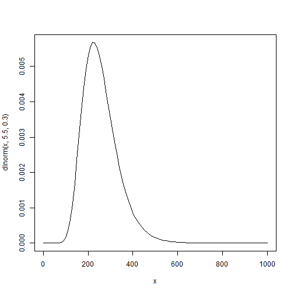
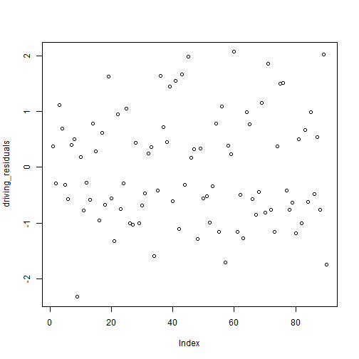
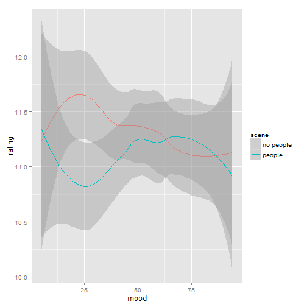
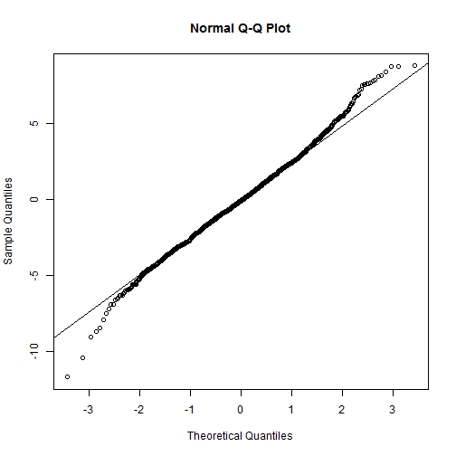

Advanced Statistics
========================================================
author: Bernhard Angele
date: Class 6, 13/11/2014

Last class
========================================================
- Time really flies when you are having fun, right?
- On the agenda for today:
    - Contrasts
    - Transformations
    - Logistic regression
    - Linear mixed models
    - Power
    - Non-parametric tests (and why we didn't talk much about them)
- Also: Assignment 2
- Assignment 1 marks:
    - By Dec 1st -- plenty of time to incorporate my feedback for Assignment 2.

Contrasts
========================================================
- The link between multiple regression and ANOVA
- Using dummy coding to turn a discrete variable into a number of "continuous" contrasts
- Many possible contrasts -- you can make your own!
    - Not very many *sensible* contrasts.
- Basic principles: A factor with $k$ levels gets split into $k-1$ contrasts.
    - i.e. one contrast per degree of freedom
- Contrasts can be, but don't have to be, **orthogonal**
    - orthogonal contrasts don't share any variance
    - non-orthogonal contrasts are fine to use, but they may be correlated
        - remember the pitfalls of multicollinearity!
        
Example
========================================================
- Enough about cats, let's talk about dogs!
- In this ficticious example, let's assume we are testing 45 dogs to see how many object names they know (e.g. when you tell them to bring you a "ball", "stick", etc., do they bring you the correct object or a random one?)
- Our sample contains 15 beagles, 15 border collies, and 15 terriers.
- Let's assume that the true means for each breed are:

| Breed        | Number of object names known|
|-------------:|----------------------------:|
| Beagle       |                           10|
| Border Collie|                           60|
| Terrier      |                           15|

Example (2)
========================================================
- With 3 means, there are (at least) 3 comparisons we can make

| Comparison              | Difference                  |
|------------------------:|----------------------------:|
| Border Collie -- Beagle |                           50|
| Border Collie -- Terrier|                           35|
| Terrier -- Beagle       |                            5|

- Let's see how the contrasts reflect these comparisons
  - But remember -- we can only make 2.
  
Generating the data
========================================================
- Feel free to skip over this if you don't care about how we generate the fake data

```r
# Seed for random number generators, so that we all get the same results
set.seed("6")
# Column 1: Breed - repeat each breed name 15 times, then combine
breed <- c(rep("Beagle", 15), rep("Border Collie", 15), rep("Terrier", 15))
# Column 2: Objects - repeat each true group mean 15 times, then combine
objects <- c(rep(10, 15), rep(60, 15), rep(15, 15))
```

Generating the data (2)
========================================================
- You can still skip this if you must...

```r
# Add random noise to the objects scores
objects <- objects + rnorm(n = 45, mean = 0 , sd = 6)
# for more realism, round the objects scores to full integers
# (what does it mean if a dog knows a fraction of an object?)
objects <- round(objects, digits = 0)
# Combine into data frame
dogs <- data.frame(breed, objects)
```

The data
========================================================

```r
# get the means for each breed
mean(dogs[dogs$breed == "Beagle",]$objects)
```

```
[1] 10.4
```

```r
mean(dogs[dogs$breed == "Border Collie",]$objects)
```

```
[1] 61.8
```

```r
mean(dogs[dogs$breed == "Terrier",]$objects)
```

```
[1] 13.93
```

```r
# or do it all in one go:
tapply(X = dogs$objects, INDEX = dogs$breed, FUN = mean)
```

```
       Beagle Border Collie       Terrier 
        10.40         61.80         13.93 
```

Comparing the means
========================================================
- We can always do pairwise *t*-tests. Those give us all the comparisons, but at the cost of making multiple comparisons.

```r
pairwise.t.test(x = dogs$objects, g = dogs$breed)
```

```

	Pairwise comparisons using t tests with pooled SD 

data:  dogs$objects and dogs$breed 

              Beagle Border Collie
Border Collie <2e-16 -            
Terrier       0.14   <2e-16       

P value adjustment method: holm 
```

Adding contrasts
========================================================
- Let's make "breed" into a factor

```r
dogs$breed <- factor(dogs$breed)
```
- R automatically assigns *treatment* contrasts to each factor, which you can look at using the `contrasts` command:

```r
contrasts(dogs$breed)
```

```
              Border Collie Terrier
Beagle                    0       0
Border Collie             1       0
Terrier                   0       1
```
- "Beagle" is the baseline level here. Why? Because it comes first alphabetically and R really has no way to know if there is another baseline level that would suit you more.

What does this contrast matrix mean?
========================================================

|              | x1| x2|
|:-------------|--:|--:|
|Beagle        |  0|  0|
|Border Collie |  1|  0|
|Terrier       |  0|  1|
- When doing a regression analysis, R will replace the factor "breed" with two contrasts, $x_1$ and $x_2$
- $x_1$ will be 1 for all "Border Collie" cases, and 0 otherwise
- $x_2$ will be 1 for all "Terrier" cases, and 0 otherwise
- Why is this a good idea?

How contrasts work
=========================================================
- Remember the linear regression equation:
- $y_{i} = \beta_0 + \beta_1 x_{1} + \beta_2 x_{2} + \epsilon_i$
- i.e. the predicted value for $y_i$ is $\hat{y_i} = \beta_0 + \beta_1 x_{1} + \beta_2 x_{2}$
- Now let's substitute in the values from the table if breed is "Beagle":

|              | x1| x2|
|:-------------|--:|--:|
|Beagle        |  0|  0|
|Border Collie |  1|  0|
|Terrier       |  0|  1|
- $\hat{y_{i}} = \beta_0 + \beta_1 \times 0 + \beta_2 \times 0 = \beta_0$
- The predicted value for the Beagle group is $\beta_0$, the intercept
- That means that in this analysis, the intercept will reflect the mean for the Beagle group (10)

How contrasts work (2)
=========================================================
- The predicted value for $y_i$ is still $\hat{y_i} = \beta_0 + \beta_1 x_{1} + \beta_2 x_{2}$
- Now let's substitute in the values from the table if breed is "Border Collie":

|              | x1| x2|
|:-------------|--:|--:|
|Beagle        |  0|  0|
|Border Collie |  1|  0|
|Terrier       |  0|  1|
- $\hat{y_{i}} = \beta_0 + \beta_1 \times 1 + \beta_2 \times 0 = \beta_0 + \beta_1$
- The predicted value for the Border Collie group is $\beta_0 + \beta_1$, i.e. the sum of the intercept and the first slope $\beta_1$
- That means that in this analysis, the slope $\beta_1$ will reflect the difference between the mean for the Border Collie group and the mean for the Beagle group ($60 - 10 = 50$)

How contrasts work (2)
=========================================================
- The predicted value for $y_i$ is still $\hat{y_i} = \beta_0 + \beta_1 x_{1} + \beta_2 x_{2}$
- Now let's substitute in the values from the table if breed is "Terrier":

|              | x1| x2|
|:-------------|--:|--:|
|Beagle        |  0|  0|
|Border Collie |  1|  0|
|Terrier       |  0|  1|
- $\hat{y_{i}} = \beta_0 + \beta_1 \times 0 + \beta_2 \times 1 = \beta_0 + \beta_2$
- The predicted value for the Border Collie group is $\beta_0 + \beta_2$, i.e. the sum of the intercept and the second slope $\beta_2$
- That means that in this analysis, the slope $\beta_1$ will reflect the difference between the mean for the Terrier group and the mean for the Beagle group ($15 - 10 = 5$)

Let's try it
==========================================================

```r
lm(data = dogs, objects ~ breed)
```

```

Call:
lm(formula = objects ~ breed, data = dogs)

Coefficients:
       (Intercept)  breedBorder Collie        breedTerrier  
             10.40               51.40                3.53  
```
- Looks just about right (remember, the means differ from the true population means because this is a -- simulated -- sample and contains random error)

Let's do the hypothesis tests
==========================================================
- First, the ANOVA:

```r
anova(lm(data = dogs, objects ~ breed))
```

```
Analysis of Variance Table

Response: objects
          Df Sum Sq Mean Sq F value Pr(>F)    
breed      2  24728   12364     304 <2e-16 ***
Residuals 42   1711      41                   
---
Signif. codes:  0 '***' 0.001 '**' 0.01 '*' 0.05 '.' 0.1 ' ' 1
```

Now, the contrasts
==========================================================

```r
summary(lm(data = dogs, objects ~ breed))
```

```

Call:
lm(formula = objects ~ breed, data = dogs)

Residuals:
   Min     1Q Median     3Q    Max 
 -9.80  -4.40  -0.40   4.07  12.20 

Coefficients:
                   Estimate Std. Error t value Pr(>|t|)    
(Intercept)           10.40       1.65    6.31  1.4e-07 ***
breedBorder Collie    51.40       2.33   22.05  < 2e-16 ***
breedTerrier           3.53       2.33    1.52     0.14    
---
Signif. codes:  0 '***' 0.001 '**' 0.01 '*' 0.05 '.' 0.1 ' ' 1

Residual standard error: 6.38 on 42 degrees of freedom
Multiple R-squared:  0.935,	Adjusted R-squared:  0.932 
F-statistic:  304 on 2 and 42 DF,  p-value: <2e-16
```

Interpreting the hypothesis tests
========================================================
- Note that we are testing the $H_0$ that $\beta_0$, $\beta_1$, $\beta_2$ are 0.
- R helpfully calls the observed coefficients $b_1$ `breedBorder Collie` and $b_2$ `breedTerrier`.
- Remember what we said about the coefficients?
- $\beta_0$ (the intercept) reflects the mean for the Beagle group
- If the intercept is significantly different from 0, that's not that interesting (but at least it is evidence that the beagles can learn more than 0 object names)
- The first slope $\beta_1$ reflects the difference between the Border Collie group and the Beagle group
- If this difference is significant, it means that there is evidence that Border Collies know more object names than Beagles

Interpreting the hypothesis tests (2)
========================================================
- The second slope $\beta_2$ reflects the difference between the Terrier group and the Beagle group
- If this difference is significant, it means that there is evidence that Terriers know more object names than Beagles
- Looking at the *t*-test results, $b_1$ is significantly different from 0, but $b_2$ isn't.
- There's a significant difference in terms of object names known between Beagles and Border Collies, but not between Beagles and Terriers
- Note that we are only doing two comparisons -- that's all we can do.

Trying different contrasts
=========================================================
- We can try some different contrast coding schemes to see how they work
- We can do this here because there are fake data and we know the actual means
- With real data, you need to plan your contrasts **before** you analyse your data (ideally, before you even collect them)
    - That's why they are called **planned** contrasts as opposed to **post hoc**.
- You can't even look at the means first!
- Otherwise, you're cheating. This is far worse than a small violation of normality or homoscedasticity!

What other contrasts does R have?
========================================================
- Sum/deviation contrasts
- (Reverse) Helmert contrasts
- many more
- Make your own!

Sum (or deviation) contrasts
==========================================================

```r
contrasts(dogs$breed) <- contr.sum
kable(coef(summary(lm(data = dogs, objects ~ breed))))
```


|            | Estimate| Std. Error|  t value| Pr(>&#124;t&#124;)|
|:-----------|--------:|----------:|--------:|------------------:|
|(Intercept) |  28.7111|     0.9514|  30.1762|             0.0000|
|breed1      | -18.3111|     1.3456| -13.6086|             0.0000|
|breed2      |  33.0889|     1.3456|  24.5913|             0.0000|

Interpreting sum/deviation contrasts
===========================================================
- The intercept $\beta_0$ is the grand mean of all the observations ($28.33$)
- $\beta_1$ is the difference between the grand mean and the mean of Beagle ($10 - 28.33 = -18.33$)
- $\beta_2$ is the difference between the grand mean and the mean of Border Collie ($60 - 28.33 = 31.67$)
- Terrier is never explicitly compared to the grand mean.
- In general: each level (except for the last level) is compared to the grand mean.

(Reverse) Helmert contrasts
==========================================================

```r
contrasts(dogs$breed) <- contr.helmert
kable(coef(summary(lm(data = dogs, objects ~ breed))))
```


|            | Estimate| Std. Error|  t value| Pr(>&#124;t&#124;)|
|:-----------|--------:|----------:|--------:|------------------:|
|(Intercept) |  28.7111|     0.9514|  30.1762|             0.0000|
|breed1      |  25.7000|     1.1653|  22.0547|             0.0000|
|breed2      |  -7.3889|     0.6728| -10.9827|             0.0000|

Interpreting (reverse) Helmert contrasts
========================================================
- The intercept $\beta_0$ is the grand mean of all the observations ($28.33$)
- $beta_1$ is half of the difference between the mean of Beagle and the mean of Border Collie ($(60 - 10)/2 = 25$)
- $beta_2$ is half of the difference between the joint mean of Beagle and Border Collie and the mean of Terrier ($(15 - (60+10)/2)/2 = -10$)
- In general: each level is compared to the mean of the previous levels

Make your own contrasts
==========================================================
- General rules: You have one contrast per degree of freedom
- The dummy values in each contrast should sum to 0 (so that your intercept will be the grand mean)
- The sum of the absolute values of the dummy values in each contrast should be 2
- If you want to compare two levels, set one to be -1 and the other to be 1
- Factor levels that you don't want to compare should be set to 0


Example
==========================================================
- I want to compare level 1 (Beagle) to level 3 (Terrier):

|             | x1 | x2|
|------------:|---:|--:|
|Beagle       |   1|TBD|
|Border Collie|   0|TBD|
|Terrier      |  -1|TBD|

- This contrast sums to 0, so the intercept should be the grand mean (unless the other contrast is something really crazy)
- The absolute values sum to 2
- The coefficient will be $Mean(Terrier) - Mean(Beagle)$, so it will be positive if the mean for Terrier is greater than that for Beagle and negative if $Mean(Beagle) > Mean(Terrier)$

More complex comparisons
==========================================================
- To compare a mean of two factor levels to the mean of another factor (e.g. the mean of Beagle and Terrier vs. the mean of Border Collie), split them up: 
    - Set the two levels that you want to take the mean of both to .5 or -.5
    - Then set the third level to -1 or 1, respectively
    - The rules still hold:
        - The dummy values in each contrast should sum to 0 (so that your intercept will be the grand mean)
        - The absolute values should sum to 2
        - Factor levels that you don't want to compare should be set to 0

Example (continued)
==========================================================
- I want to compare level 1 (Beagle) to level 3 (Terrier):

|             | x1 | x2|
|------------:|---:|--:|
|Beagle       |   1|-.5|
|Border Collie|   0|  1|
|Terrier      |  -1|-.5|

- Both contrasts sum to 0, so the intercept should be the grand mean
- The absolute values sum to 2
- The coefficient for x2 will be $Mean(Terrier) - Mean(Beagle)$, so it will be positive if the mean for Terrier is greater than that for Beagle and negative if $Mean(Beagle) > Mean(Terrier)$

Defining your own contrast coding
========================================================
- You'll need the library "MASS"
    - If you don't have it yet, install it: `install.packages("MASS")`
- Put together the contrast matrix:

```r
x1 <- c(1, 0, -1)
x2 <- c(-.5, 1 , -.5)
# cbind: bind the vectors together as columns in a matrix
my_contrasts <- cbind(x1, x2)
```

Defining your own contrast coding (2)
========================================================
- Now you can assign the contrasts
- Important: you don't actually assign your home-made contrast matrix itself, but rather the transposed generalised inverse of the matrix
    - Why? That's just how R expects to get the contrasts...
- The only thing you need to be aware of is that `ginv` requires the `MASS` package to be loaded:

```r
library(MASS)
contrasts(dogs$breed) <- t(ginv(my_contrasts))
```

Interpreting the results
=======================================================

```r
kable(coef(summary(lm(data = dogs, objects ~ breed))))
```


|            | Estimate| Std. Error| t value| Pr(>&#124;t&#124;)|
|:-----------|--------:|----------:|-------:|------------------:|
|(Intercept) |  28.7111|     0.9514| 30.1762|             0.0000|
|breed1      |  -3.5333|     2.3306| -1.5161|             0.1370|
|breed2      |  49.6333|     2.0183| 24.5913|             0.0000|
- The intercept $\beta_0$ is the grand mean of all the observations ($28.33$)
- $\beta_1$ is the difference between the mean of Beagle and the mean of Terrier ($10 - 15 = -5$)
- $\beta_2$ is the difference between the mean of Beagle and Terrier together and the mean of Border Collie ($60 - (10+15)/2 = 47.5$)
- Once again, notice that the sample coefficients $b_0$, $b_1$, and $b_2$ are not *exactly* the same as the population coefficients $\beta_0$, $\beta_1$, and $\beta_2$.

Orthogonality of contrasts
=======================================================
- If contrasts are orthogonal, that means they do not share any variance
    - i.e. they are not correlated
- You can find out if your hand-made contrasts are orthogonal:
- Calculate the product of each row
- If the row products sum up to 0, the contrast is orthogonal:

|             | x1 | x2| x1*x2|
|------------:|---:|--:|-----:|
|Beagle       |   1|-.5|   -.5|
|Border Collie|   0|  1|     0|
|Terrier      |  -1|-.5|    .5|
|*Total*      |   0|  0|     0|

- Are our contrasts orthogonal? Yes!

Orthogonality of contrasts (2)
=======================================================
- Contrasts do not have to be orthogonal (also known as *independent*).
- But be aware that correlated contrasts may cause multicollinearity issues
    - Especially if you have an unbalanced design
    - Especially if you have an interaction design
- As long as you are aware of what exactly you are doing, you'll be fine
- As soon as you no longer know what you're doing, ask for help!

Transformations
========================================================
- In some cases, our dependent variable will not be normally distributed
- Example: reaction times -- you get a long right tail of slow responses
    - Fixation times in eye movements are very similar

Example
========================================================
- For example, the probability density function for fixation durations might look like this:

 

Example data
========================================================
- Example experiment: how long do people look at swear words vs. non-swear words?
    - Let's assume that the true means are 250 ms for non swear words and 300 ms for swear words
- Let's generate data based on this assumption

```r
set.seed("11233")
# 60 subjects
word_condition <- factor(c(rep("swear word", 30), rep("non swear word", 30)))
# rlnorm: Generate random samples from the lognormal distribution
fixation_time <- c(rlnorm(n = 30, mean = log(250), sd = .3), rlnorm(n = 30, mean = log(265), sd = .3))
swear_exp <- data.frame(word_condition, fixation_time)
```

Running a linear model
========================================================

```r
linear_model <- lm(data = swear_exp, fixation_time ~ word_condition)
summary(linear_model)
```

```

Call:
lm(formula = fixation_time ~ word_condition, data = swear_exp)

Residuals:
   Min     1Q Median     3Q    Max 
-125.3  -62.9  -14.4   47.4  242.7 

Coefficients:
                         Estimate Std. Error t value Pr(>|t|)    
(Intercept)                 304.2       14.9   20.47   <2e-16 ***
word_conditionswear word    -50.8       21.0   -2.42    0.019 *  
---
Signif. codes:  0 '***' 0.001 '**' 0.01 '*' 0.05 '.' 0.1 ' ' 1

Residual standard error: 81.4 on 58 degrees of freedom
Multiple R-squared:  0.0917,	Adjusted R-squared:  0.076 
F-statistic: 5.85 on 1 and 58 DF,  p-value: 0.0187
```

Assumption test
========================================================

```r
shapiro.test(resid(linear_model))
```

```

	Shapiro-Wilk normality test

data:  resid(linear_model)
W = 0.9491, p-value = 0.01417
```
- Clearly not normal!
- But notice how robust the analysis is. We still find the effect!
- Nevertheless, better to run a proper model with log transformed values as the dependent vairable


Running a log model
========================================================

```r
log_model <- lm(data = swear_exp, log(fixation_time) ~ word_condition)
summary(log_model)
```

```

Call:
lm(formula = log(fixation_time) ~ word_condition, data = swear_exp)

Residuals:
    Min      1Q  Median      3Q     Max 
-0.5636 -0.2392 -0.0132  0.1797  0.6319 

Coefficients:
                         Estimate Std. Error t value Pr(>|t|)    
(Intercept)                5.6835     0.0524  108.37   <2e-16 ***
word_conditionswear word  -0.1951     0.0742   -2.63    0.011 *  
---
Signif. codes:  0 '***' 0.001 '**' 0.01 '*' 0.05 '.' 0.1 ' ' 1

Residual standard error: 0.287 on 58 degrees of freedom
Multiple R-squared:  0.107,	Adjusted R-squared:  0.0912 
F-statistic: 6.92 on 1 and 58 DF,  p-value: 0.0109
```

Assumption test
========================================================

```r
shapiro.test(resid(log_model))
```

```

	Shapiro-Wilk normality test

data:  resid(log_model)
W = 0.9823, p-value = 0.5325
```

How to interpret a log model
========================================================
- Formula: $ln(y_{i}) = \beta_0 + \beta_1 x_{i1} + \beta_2 x_{i2} + \epsilon_i$
- Let's rewrite that: $y_{i} = e^{\beta_0 + \beta_1 x_{i1} + \beta_2 x_{i2} + \epsilon_i} = e^{\beta_0} \times e^{\beta_1x_{i1}} \times e^{\beta_2x_{i2}}$
    - If this confuses you: we are using the natural logarithm ($ln$; R somewhat confusingly calls it `log`) here. This is a logarithm to the base $e ~ 2.718$. Maybe you'll remember that $e^{ln(x)} = x$
- Log models are *multiplicative* rather than *additive*

How to interpret a log model (2)
========================================================
- Example: Our swear word fixation time study
    - Fitted model: $ln(y_{i}) = 5.683 - .195 \times x_i$
    - Remember: We're using treatment contrasts. $x_i$ is 0 for non swear words and 1 for swear words
    - Predicted value for non swear words: $e^{5.683} \times e^{-.195 \times 0} = e^{5.683} =  293.82$
    - Predicted value for swear words: $e^{5.683} \times e^{-.195 \times 1} = 293.82 \times e^{-.195} = 293.82 * .823 = 241.81$
- Conclusion: Fixation times on swear words were 17.7% lower than fixation times on non swear words (*b* = -.195, *SE* = .074, *t* = -2.63, *p* = .011).

Logistic regression
========================================================
- What if we have a dichotomous dependent variable?
    - Yes vs. no, error vs. no error, alive vs. dead, pregnant vs. not pregnant
- Our example (from A. Johnson): Factors that make (or don't make) you fail your driving test
- 90 candidates
- Dependent variable: `Driving.Test`
- Predictor variables:
    - `Practice`: in hours
    - `Emergency.Stop`: Whether the candidate performed the emergency stop (yes or no)
    - `Examiner`: How difficult the examiner is (on a scale from 0 = easy to 100 = extremely difficult)
    - `Cold.Remedy`: How many doses of cold remedy the candidate had before the test

Where to start?
=========================================================
- We would like to use our standard regression model $y_{i} = \beta_0 + \beta_1 x_{i1} + \beta_2 x_{i2} + \epsilon_i$
- But our data are definitely not normally distributed (they aren't even continuous)
- First step: represent the data as probabilities rather than Yes or No
    - What's the probability of passing the test given that I've had (at most) 20 hours of practice, did my emergency stop, had at most an average examiner (50) and had only one cup of cold remedy?
    - Probabilities are still weird: They only go from 0 to 1, and they also aren't great for linear relationships
    - Let's try something else: odds
    
Probability and odds
========================================================
- Very popular in betting, since they make it easy to estimate the payout
- $Odds = \frac{P}{1-P}$
- For example: 
      - $P = .5$ gives you even odds $\frac{.5}{.5} = 1/1$
      - $P = .25$ gives you $\frac{.25}{.75} = 1/3$
      - $P = .75$ gives you $\frac{.75}{.25} = 3/1$
- Odds are nice because they aren't bounded, but for high probabilities they get very large very quickly ($P = .99 \Leftrightarrow Odds = 99/1$) and for small probabilities, they get very small very quickly ($P = .01 \Leftrightarrow Odds = 1/99$)
- What to do?

Log odds (logits)
=========================================================
- Just transform our odds (just like we did with our continuous fixation time variable earlier) by taking the natural logarithm: $logit = ln(Odds) = ln(\frac{P}{1-P})$
- Now we have a dependent measure that is suitable for linear relationships
- Our new logistic regression model is $ln(\frac{P}{1-P}) = \beta_0 + \beta_1 x_{i1} + \beta_2 x_{i2} + \epsilon_i$
- If we want to get back to probabilities, we can exponentiate both sides of the equation: $\frac{P}{1-P} = e^{\beta_0 + \beta_1 x_{i1} + \beta_2 x_{i2} + \epsilon_i}$
- Solving this for $P$: $P = \frac{e^{\beta_0 + \beta_1 x_{i1} + \beta_2 x_{i2} + \epsilon_i}}{1 + e^{\beta_0 + \beta_1 x_{i1} + \beta_2 x_{i2} + \epsilon_i}} = \frac{1}{1 + e^{-(\beta_0 + \beta_1 x_{i1} + \beta_2 x_{i2} + \epsilon_i)}}$

How do you fit a logistic regression line?
=========================================================
- Least squares won't work
- We can evaluate the **likelihood** of the parameters instead
- Probability: observations given parameters
- Likelihood: parameters given observations

Calculating likelihood
========================================================
- Very simple example: Let's assume we have the following data from flipping a coin: $Y = (H H H T H T H H)$
- Likelihood is the product of all the probabilities given a certain parameter value. In this case, we are trying different parameter values for the probability: 
    - We usually call the observed probability $p$, but since we are trying different population parameters, we'll give it a greek letter and call our population probability of observing "heads" (ignoring order) $\pi$ (that is, pi)
- $\pi = .5$: $L(Y|\pi = .5) = .5 \times .5 \times .5 \times .5 \times .5 \times .5 \times .5 \times .5 = .5^8 = .00039$
- $\pi = .25$: $L(Y|\pi = .35) = .25 \times .25 \times .25 \times .75 \times .25 \times .75 \times .25 \times .25 = .25^6 \times .75^2 = .00014$
    - $\pi = .25$ has a lower likelihood than $\pi = .5$.
- Let's try $\pi = .75$: $L(Y|\pi = .75) = .75 \times .75 \times .75 \times .25 \times .75 \times .25 \times .75 \times .75 = .75^6 \times .25^2 = .00111$
    - This is the highest one yet.

The likelihood function for logistic regression
========================================================
- Do you see a pattern here? For each element $Y_i$ in $Y$, the likelihood of $\pi$ is either
    - $L(Y_i|\pi) = \pi$ if $Y_i = H$, (e.g. $.75$ for $\pi = .75$), or
    - $L(Y_i|\pi) = 1 - \pi$ if $Y_i = T$, (e.g. $.25$ for $\pi = .75$)
- Then you get the likelihood for the full data set $Y$ by multiplying all the individual likelihoods
    - $L(Y|\pi) = \prod_{i = 1}^N{L(Y_i|\pi)}$
- You can simplify this a bit if you replace H with 1 and T with 0:
    -  $L(Y_i|\pi) = \pi^{Y_i} \times (1-\pi)^{(1-Y_i)}$
    - And combining the two equations above:
        - $L(Y|\pi) = \prod_{i = 1}^N\pi^{Y_i} \times (1-\pi)^{(1-Y_i)}$

Maximum likelihood
========================================================
- Likelihood gets a little unwieldy -- lots of very small numbers
    - Solution: take the log (who would have thought?)
        - Added bonus: Now our multiplication becomes a sum (remember that from calculus?)
          $log\;likelihood = \sum_{i = 1}^N Y_i\times ln(\pi) + (1-Y_i)\times ln(1-\pi)$
- Now we can simply try different values of $\pi$ until we find the one with the maximum likelihood
    - Remember that in logistic regression, $\pi$ is defined by our regression equation: $\pi = \frac{1}{1 + e^{-(\beta_0 + \beta_1 x_{i1} + \beta_2 x_{i2} + \epsilon_i)}}$ 
    - Instead of simply trying different values of $\pi$, we have to try different values for $\beta_0$, $\beta_1$, etc. and compute $\pi$. This gets to be quite a lot of work.
    - Trying different values might not seem particularly elegant, but this is essentially what R or SPSS do -- no simple solution like with least-squares regression or ANOVA exists
      - This is (relatively) processing-intensive. One reason why psychologists didn't use logistic regression in the statistics-by-hand era.
      
Log likelihood as an indicator of model fit
=======================================================
- The log likelihood (LL) of the final model is an indicator of how well the model fit the data, just like $R^2$.
    - In fact, there are several ways to estimate $R^2$ from the log likelihood
- Log likelihood also enables us to make model comparisons
    - The test statistic in that case is $\chi^2$ -- more about that later
- Another measure is *deviance*, which is simply $-2$*LL
    - Conceptually, deviance is like the residual variance.
        - In the case of deviance, lower is better, of course.
- Closely related to this is Akaike's Information Criterion (AIC), which is -2LL+2*number of parameters (lower is better, so adding parameters makes the AIC worse)

Enough maths, let's just run this model
=======================================================
- These are our data (first 6 rows):

```r
driving_tests <- read.csv("driving_tests.csv")
kable(head(driving_tests))
```


|Driving.Test | Practice| Emergency.Stop| Examiner| Cold.Remedy|
|:------------|--------:|--------------:|--------:|-----------:|
|Yes          |       45|              1|       23|           0|
|No           |       18|              0|       88|           0|
|Yes          |       25|              0|       15|           0|
|Yes          |       30|              1|        4|           0|
|No           |       20|              1|       82|           5|
|No           |       25|              0|       75|           0|

Fitting the model
========================================================
- We use `glm` instead of `lm` (short for generalised linear model)
- We tell `glm` that our data are binomial and we want to use the logit function as the link
- Note that, for simplicity, we're not investigating interactions here (let's assume that in this example we simply aren't interested in them)

```r
driving_glm <- glm(data = driving_tests, formula = Driving.Test ~ Practice + Emergency.Stop + Examiner + Cold.Remedy, family = binomial(link = "logit"))
```

Model summary
========================================================

```r
summary(driving_glm)
```

```

Call:
glm(formula = Driving.Test ~ Practice + Emergency.Stop + Examiner + 
    Cold.Remedy, family = binomial(link = "logit"), data = driving_tests)

Deviance Residuals: 
   Min      1Q  Median      3Q     Max  
-2.266  -0.732  -0.301   0.663   2.021  

Coefficients:
               Estimate Std. Error z value Pr(>|z|)    
(Intercept)     -2.4057     1.1867   -2.03   0.0426 *  
Practice         0.1296     0.0303    4.28  1.9e-05 ***
Emergency.Stop   0.0494     0.5912    0.08   0.9334    
Examiner        -0.0348     0.0130   -2.68   0.0074 ** 
Cold.Remedy     -0.0765     0.1685   -0.45   0.6501    
---
Signif. codes:  0 '***' 0.001 '**' 0.01 '*' 0.05 '.' 0.1 ' ' 1

(Dispersion parameter for binomial family taken to be 1)

    Null deviance: 124.366  on 89  degrees of freedom
Residual deviance:  82.572  on 85  degrees of freedom
AIC: 92.57

Number of Fisher Scoring iterations: 5
```

Model summary explained
========================================================
- Deviance residuals:
    - For these, we calculate the deviance separately for each case and then take the square root. We also change the sign depending on whether the observed case was 1 or 0:
    - $d_i = s_i \sqrt{-2(Y_i\times ln(\pi) + (1-Y_i)\times ln(1-\pi))}$
        - with $s_i = 1$ if $Y_i = 1$ and $s_i = -1$ if $Y_i = 0$

How to interpret logistic regression residuals
========================================================
- Can't test if they are normally distributed (because they are not)
- But look out for very large residuals
- You can get standardised residuals using `rstandard`.
    - Look out for cases that are far away from 0.

```r
driving_residuals <- rstandard(driving_glm)
plot(driving_residuals)
```

 

Model summary explained (2)
==========================================================
- The coefficients

|               | Estimate| Std. Error| z value| Pr(>&#124;z&#124;)|
|:--------------|--------:|----------:|-------:|------------------:|
|(Intercept)    |  -2.4057|     1.1867| -2.0272|             0.0426|
|Practice       |   0.1296|     0.0303|  4.2796|             0.0000|
|Emergency.Stop |   0.0494|     0.5912|  0.0836|             0.9334|
|Examiner       |  -0.0348|     0.0130| -2.6794|             0.0074|
|Cold.Remedy    |  -0.0765|     0.1685| -0.4537|             0.6501|
- Analogous to linear regression: *b* value, *SE*, significance test
- Using the **Wald** statistic instead of *t* tests
    - $z = \frac{b}{SE_b}$
    - Can be interpreted like *z* values from a standard normal distribution (that's how the *p*-value is computed)

Interpreting the b values
==========================================================
- If you take the exponential of the coefficients (using `exp()` or `e^` in R), you get an **odds ratio**
- Odds ratio = Odds after a unit change in the predictor divided by the original odds
- Example: According to our model, each hour of practice increases the odds of passing the test by a factor of $e^{0.12959} = 1.1384$
    - e.g. if the odds were even (1/1) for X hours of practice, they would be slightly better than even (1.138/1) for X+1 hours of practice
- On the other hand, each "unit" of examiner difficulty decreases the odds of passing the test by a factor of $e^{-0.03485} = 0.9658$
    - e.g. if the odds were even (1/1) for an instructor with a difficulty of X, they would be slightly worse than even (0.9658/1) for an instructor with a difficulty of X+1

Model summary explained (2)
==========================================================
- Null deviance: deviance from a model that estimates all values using the overall probability of passing the test (without taking into account the 4 predictors)
- Residual deviance: deviance from the current model (note that we're losing 4 df due to the 4 predictors)
- AIC: residual deviance + 2*model df (note that the model has 5 df, including one for the intercept)

Model comparisons (LRT)
==========================================================
- Deviance has some neat properties
    - We can compare likelihoods just like we compared mean squares in the F-test: by dividing them
    - That is, we compute a likelihood ratio: $LR = \frac{L_{baseline}}{L_{new}}$, where *baseline* is the simpler model and *new* the more complex model.
    - Now we can convert this likelihood ratio into a deviance: $deviance_{LR} = -2\frac{ln(L_{baseline})}{ln(L_{new})} = deviance_{baseline} - deviance_{new}$
    - And now the most fun part: If the $H_0$ that the two models explain the data equally well is true, this likelihood-ratio deviance is distributed according to a $\chi^2$ distribution.
    - The $\chi^2$ distribution has one parameter, degrees of freedom
    - $df = k_{new}$ - $k_{baseline}$, where $k$ is the number of parameters (including the intercept)

Model comparisons
==========================================================
- Now we can get a *p*-value! This is called the **Likelihood ratio test (LRT)**
- So, if we want to test if the model is better than a model with just the intercept, we can do an LRT
- $\chi^2 = deviance_{null} - deviance_{model} = 124.366 - 82.572 = 41.794$
- $df = k_{null} - k_{model} = 89 - 85 = 4$ 
- $p(\chi^2(4) \geq 41.794) < .01$
- This is equivalent to the overall F-test for the model.

Model comparisons (2)
========================================================
- We can use model comparisons to test how specific predictors contribute to the whole model (analogous to the F-tests in linear regression)
- For this, you can use the `Anova` command from the `car` package:

```r
library(car)
Anova(driving_glm)
```

```
Analysis of Deviance Table (Type II tests)

Response: Driving.Test
               LR Chisq Df Pr(>Chisq)    
Practice          28.93  1    7.5e-08 ***
Emergency.Stop     0.01  1     0.9334    
Examiner           8.11  1     0.0044 ** 
Cold.Remedy        0.22  1     0.6421    
---
Signif. codes:  0 '***' 0.001 '**' 0.01 '*' 0.05 '.' 0.1 ' ' 1
```

Model comparisons (3)
========================================================
- This analysis of deviance follows the same logic as the ANOVA in the linear regression case
- You can do Type I, Type II, and Type III LRT tests (they are not sums of squares in this case)
- The LRTs are better tests than the Wald tests, since the Wald tests might be prone to overinflating the SE, leading to Type II error.
- You can also use the LRT to directly compare a model to another (just like in the linear regression case). For this, you can use the `anova` command (lower case `a`).

Diagnostics and assumption tests
========================================================
- We do not assume normality (so nothing to test for that one)
- All the influence measures from linear regression work in logistic regression as well
    - See Class 5 notes for explanations and criteria

```r
kable(head(influence.measures(driving_glm)$infmat))
```


|  dfb.1_| dfb.Prct| dfb.Em.S| dfb.Exmn| dfb.Cl.R|   dffit|  cov.r| cook.d|    hat|
|-------:|--------:|--------:|--------:|--------:|-------:|------:|------:|------:|
| -0.0181|   0.0485|   0.0157|  -0.0336|  -0.0035|  0.0640| 1.0830| 0.0004| 0.0284|
| -0.0180|   0.0302|   0.0189|  -0.0312|   0.0161| -0.0494| 1.0845| 0.0002| 0.0268|
|  0.3418|  -0.0665|  -0.2944|  -0.2826|   0.0037|  0.4241| 1.1197| 0.0232| 0.1221|
|  0.0672|   0.0324|   0.0238|  -0.1501|   0.0108|  0.1822| 1.1013| 0.0036| 0.0640|
| -0.0032|   0.0268|  -0.0175|  -0.0211|  -0.0407| -0.0615| 1.0935| 0.0004| 0.0357|
| -0.0468|   0.0535|   0.0690|  -0.0643|   0.0457| -0.1271| 1.0905| 0.0017| 0.0462|

Diagnostics and assumption tests (2)
========================================================
- Multicollinearity:
- You can get Variance Inflation Factors (VIFs)
    - Again, see Class 5 notes for explanations and criteria

```r
vif(driving_glm)
```

```
      Practice Emergency.Stop       Examiner    Cold.Remedy 
         1.057          1.062          1.199          1.100 
```

Linearity
=============================================================
- This is a new one: Test if the effects of the predictors on the logits are actually linear
- How to do it: run a model that includes interactions between each *continuous* predictor and its logarithm
- Test each interaction in a separate model
- If you have 0s in your data, you might need to replace them by a very small value since log(0) = -Inf
- If the interaction is significant, linearity is violated

Linearity (2)
=============================================================

```r
# remove 0s by adding a very small number to Cold.Remedy
# test each factor in a separate model
driving_tests$Cold.Remedy_no_0 <- driving_tests$Cold.Remedy + 1
driving_glm_linearity <- glm(data = driving_tests, formula = Driving.Test ~ Practice + Emergency.Stop + Examiner + Cold.Remedy_no_0 + Practice:log(Practice) + Examiner:log(Examiner) + Cold.Remedy_no_0:log(Cold.Remedy_no_0), family = binomial(link = "logit"))
```


Linearity(3)
=============================================================

```r
kable(coef(summary(driving_glm_linearity)))
```


|                                       | Estimate| Std. Error| z value| Pr(>&#124;z&#124;)|
|:--------------------------------------|--------:|----------:|-------:|------------------:|
|(Intercept)                            | -11.1434|     6.2465| -1.7840|             0.0744|
|Practice                               |   0.9649|     0.6933|  1.3919|             0.1640|
|Emergency.Stop                         |  -0.2542|     0.6679| -0.3806|             0.7035|
|Examiner                               |  -0.4805|     0.2816| -1.7062|             0.0880|
|Cold.Remedy_no_0                       |   6.0141|     2.4454|  2.4593|             0.0139|
|Practice:log(Practice)                 |  -0.1784|     0.1523| -1.1715|             0.2414|
|Examiner:log(Examiner)                 |   0.0902|     0.0577|  1.5642|             0.1178|
|Cold.Remedy_no_0:log(Cold.Remedy_no_0) |  -3.0393|     1.2698| -2.3935|             0.0167|
- There is an issue with the linearity of Cold.Remedy, suggesting that this variable might have to be transformed/coded as a factor/etc.
    - Maybe this is why we don't see a significant effect?

Reporting it
=============================================================
A logistic regression was conducted where the dependent variable was passing a driving test and the predictor variables were hours of practice, whether an emergency stop was successfully executed, how much the examiner was difficult, and amount of 'cold remedy drinks' consumed.  90 cases were examined and the model was found to significantly predict whether the test was passed (omnibus chi-square = 41.79, df=4, p<.001). that practice and examiner were the only two variables that reliably predicted if the driving test was passed. Increases in practice was associated with increased rate of passing (odds of passing increased by 1.14 per hour of practice, *b* = .130, SE = .03, *z* = 4.28, *p* < .01). Increases in the examiner being an difficult reduced the rate of passing (odds of passing decreased by 0.96 per unit of difficulty rating, *b* = -.00349, SE = .013, *z* = -2.679, *p* < .01). None of the other predictors reached significance (all *p*s > .05). There were no issues due to multicollinearity or influential cases, however, the linearity assumption was violated for the cold remedy drinks predictor. 

Linear mixed models (LMMs)
============================================================
- The final step to greatness!
    - Note that we can really only scratch the surface here.
- Main issue:
    - We know how to to regressions for continuous and discrete DVs now
    - We know what the regression equivalent of a between-subjects ANOVA is and we can take the regression analysis much further than an ANOVA or ANCOVA would let us
    - However: 
        - What if we have a within-subject or repeated measures design?
        - What if there is some other underlying correlation in the data 
            - e.g. data collected from students in different classes in different schools
                - Surely the classes and schools share some variance -- how to account for that?
                
Moving from linear regression to linear mixed models
=============================================================
- In repeated-measures ANOVA, we've dealt with within-subjects effects by removing the variance due to subject differences from the error
    - Essentially, we have added a "subject" factor to the model
    - Linear mixed models enable us to do the same thing for regression analyses

Problem: how to add subject as a factor
=============================================================
- We could simply add a "subject" factor to the predictors
    - This would reflect the systematic differences between subjects
        - But that's not quite right: how do we deal with a factor with 40 levels?
            - Also, we want to generalise our model to more than those 40 subjects that are in the analysis
            - How do we do that?
    - Subject is really like a random variable: we get a different set each time we run the experiment
    - Instead of analysing the subject effect in a generalisable way, we really just want to get rid of the subject variance in the most efficient way possible

Problem: how to add subject as a factor (2)
=============================================================
- Fixed effects vs. random effects
    - Fixed effects: repeatable, generalisable (e.g. experiment condition)
    - Random effects: non-repeatable, sampled from a general population
    - Mixed effects models include both fixed and random effects
- Another issue with including subject as a fixed effect:
    - Each subject would take up a degree of freedom
    - That would majorly impact the power of our analysis
    - LMMs solve this issue by a procedure called **shrinkage**
    
Shrinkage
===============================================================
- Conceptually, LMMs allow subjects to have individual effects (e.g. in an eye-tracking experiment subject 1 might have an intercept of 200 ms, while subject 2 might have an intercept of 210 ms), but they pull each subject's effects
towards an underlying distribution of subject effects
- This reflects the idea that if 20 other subjects have intercepts between 180 and 220 ms, the current subject is unlikely to have an intercept of 400 ms, even though it looks like that from the data
- Shrinkage also helps majorly with missing data issues (although it won't fix them for you!)
- The downside of shrinkage is that it isn't clear what the df_{Error} should be
    - This leads to some issues later on.
    
Example
==============================================================
A PhD student wants to investigate whether our mood affects how we react to visual scenes. In order to do this, she showed 40 subjects a total of 40 scenes. There are two version of each scene: one contains people, the other one doesn't -- everything else is identical. The PhD student spent a considerable amount of time taking photos to ensure this (until her supervisor got a bit impatient). Before the experiment, all subjects were asked to rate their current mood on a scale from 0 (very sad) to 100 (very happy). They then looked at each scene and rated how much they liked it on a scale from 0 (hate it) to 20 (love it). The student's hypothesis is that if you are happy, you should want to see scenes with people. If you are unhappy, you should prefer scenes without people. The data are given below. Will the student find what she is looking for? Or will she have to start from scratch and be in even more trouble with her supervisor?

Example Data
==============================================================
- Subject: Subject ID (1-40)
- Item: Item ID (1-40)
- Scene Type: within-item factor ("no people" vs. "people")
- Mood: between-subject factor (scale from 0--100)
- Rating: Dependent variable (scale from 0 to 20)

```r
# Start by loading the data
scene_liking <- read.csv("Class 6 exercise data.csv")
```

Looking at the data
=========================================================

```r
kable(head(scene_liking))
```


| subject| item|scene     | mood| rating|
|-------:|----:|:---------|----:|------:|
|       1|    1|people    |   55|   12.2|
|       1|    2|no people |   55|    8.5|
|       1|    3|people    |   55|   10.7|
|       1|    4|no people |   55|   12.0|
|       1|    5|people    |   55|   12.3|
|       1|    6|no people |   55|   16.0|

Looking at the data (2)
=========================================================

```r
str(scene_liking)
```

```
'data.frame':	1600 obs. of  5 variables:
 $ subject: int  1 1 1 1 1 1 1 1 1 1 ...
 $ item   : int  1 2 3 4 5 6 7 8 9 10 ...
 $ scene  : Factor w/ 2 levels "no people","people": 2 1 2 1 2 1 2 1 2 1 ...
 $ mood   : int  55 55 55 55 55 55 55 55 55 55 ...
 $ rating : num  12.2 8.5 10.7 12 12.3 16 8.2 13.2 6.7 6.9 ...
```

```r
# We should set subject and item to be factors
scene_liking$subject <- factor(scene_liking$subject)
scene_liking$item <- factor(scene_liking$item)
```

Calculating means
=========================================================
- Let's get condition means for scene type
- We can't really use `ez` for this, since we have two random variables
- In theory, we could report means by subject or means by item
- Either one would be fine, but usually people report subject means.
    - We use `melt` and `cast` from the `reshape` package to calculate the means

```r
library(reshape)
# set rating as the dependent (measure) variable
scene_liking.m <- melt(scene_liking, measure = "rating")
# collapse over item; calculate means
scene_liking.c <- cast(scene_liking.m, subject + mood + scene ~ variable, mean)
```

Calculating means (2)
=========================================================

```r
head(scene_liking.c)
```

```
  subject mood     scene rating
1       1   55 no people  10.87
2       1   55    people  10.36
3       2   56 no people  10.91
4       2   56    people  10.79
5       3   16 no people  12.33
6       3   16    people  11.54
```

Calculating means (2)
=========================================================
- Now we can use this to calculate our means for the scene condition

```r
(mean_people <- mean(subset(scene_liking.c, scene == "people")$rating))
```

```
[1] 11.12
```

```r
(mean_no_people <- mean(subset(scene_liking.c, scene == "no people")$rating))
```

```
[1] 11.33
```

Calculating means (3)
=========================================================
- Let's also get sd, N, and SE

```r
(sd_people <- sd(subset(scene_liking.c, scene == "people")$rating))
```

```
[1] 0.6142
```

```r
(sd_no_people <- sd(subset(scene_liking.c, scene == "no people")$rating))
```

```
[1] 0.6162
```

```r
(N_people <- length(subset(scene_liking.c, scene == "people")$rating))
```

```
[1] 40
```

```r
(N_no_people <- length(subset(scene_liking.c, scene == "no people")$rating))
```

```
[1] 40
```

```r
(SE_people <- sd_people/sqrt(N_people))
```

```
[1] 0.09711
```

```r
(SE_no_people <- sd_no_people/sqrt(N_no_people))
```

```
[1] 0.09743
```

Plotting the interaction
==========================================================
- We're really interested in the interaction between `scene` and `mood`.
    - Unfortunately, mood is a continuous variable
    - How to plot this?
- Use `qplot` from `ggplot2` with `geom = "smooth"`
    - This will give you a plot showing a smoothed conditional mean for each value of mood

Plotting the interaction (2)
=========================================================

```r
library(ggplot2)
qplot(data = scene_liking, y = rating, x = mood, colour = scene, geom = "smooth")
```

 

Plotting the interaction (2)
=========================================================
- Looks like the student was right!
- Also looks like the effect is not really completely linear
    - Maybe this is due to the subject and item effects in the data?
    - Let's find out!

Start with linear regression
=========================================================
- Let's check our contrasts for `scene`

```r
contrasts(scene_liking$scene)
```

```
          people
no people      0
people         1
```
- Are we happy with this?
    - Sure -- we just have to be aware of the coding when we interpret the coefficients

Run the model
=========================================================

```r
scene_lm <- lm(data = scene_liking, rating ~ mood * scene)
kable(coef(summary(scene_lm)))
```


|                 | Estimate| Std. Error| t value| Pr(>&#124;t&#124;)|
|:----------------|--------:|----------:|-------:|------------------:|
|(Intercept)      |  11.7066|     0.2475| 47.2936|             0.0000|
|mood             |  -0.0073|     0.0044| -1.6505|             0.0990|
|scenepeople      |  -0.7583|     0.3501| -2.1663|             0.0304|
|mood:scenepeople |   0.0107|     0.0063|  1.6959|             0.0901|
- Where did the interaction go?
- Let's do some quick diagnostics

Regression diagnostics
=========================================================
- Multicollinearity?

```r
vif(scene_lm)
```

```
      mood      scene mood:scene 
      2.00       7.03       8.03 
```
- Aha! Those VIFs are quite  a bit larger than 1. That spells trouble.
- What is wrong?

Addressing multicollinearity
=========================================================
- What is wrong?
- We forgot to center the continuous predictor `mood`
- Let's fix this:

```r
scene_liking$mood <- scale(scene_liking$mood, scale = FALSE) # See Class 5
```

Run the model again
=========================================================

```r
scene_lm <- lm(data = scene_liking, rating ~ mood * scene)
kable(coef(summary(scene_lm)))
```


|                 | Estimate| Std. Error|  t value| Pr(>&#124;t&#124;)|
|:----------------|--------:|----------:|--------:|------------------:|
|(Intercept)      |  11.3283|     0.0934| 121.3420|             0.0000|
|mood             |  -0.0073|     0.0044|  -1.6505|             0.0990|
|scenepeople      |  -0.2085|     0.1320|  -1.5792|             0.1145|
|mood:scenepeople |   0.0107|     0.0063|   1.6959|             0.0901|
- Still not quite there...
- Let's do more diagnostics

Regression diagnostics -- again
=========================================================
- Multicollinearity?

```r
vif(scene_lm)
```

```
      mood      scene mood:scene 
         2          1          2 
```
- The VIFs are fine now.

Influential cases
=========================================================

```r
kable(head(influence.measures(scene_lm)$infmat))
```


|  dfb.1_| dfb.mood| dfb.scnp| dfb.md:s|   dffit|  cov.r| cook.d|    hat|
|-------:|--------:|--------:|--------:|-------:|------:|------:|------:|
|  0.0000|   0.0000|   0.0101|   0.0017|  0.0145| 1.0034| 0.0001| 0.0013|
| -0.0376|  -0.0062|   0.0266|   0.0044| -0.0381| 1.0010| 0.0004| 0.0013|
|  0.0000|   0.0000|  -0.0041|  -0.0007| -0.0059| 1.0037| 0.0000| 0.0013|
|  0.0093|   0.0015|  -0.0066|  -0.0011|  0.0095| 1.0036| 0.0000| 0.0013|
|  0.0000|   0.0000|   0.0111|   0.0018|  0.0159| 1.0033| 0.0001| 0.0013|
|  0.0630|   0.0104|  -0.0446|  -0.0073|  0.0639| 0.9959| 0.0010| 0.0013|
- Any Cook's d greater than 1?

```r
sum(cooks.distance(scene_lm) > 1 )
```

```
[1] 0
```
- Doesn't look like it, so we should be fine here.

Normality
=========================================================

```r
shapiro.test(resid(scene_lm))
```

```

	Shapiro-Wilk normality test

data:  resid(scene_lm)
W = 0.9949, p-value = 2.632e-05
```
- Whoa! But we saw this in the plot already

Q-Q Plots
===========================================================
- Here's a visual way to assess normality
- Quantile-Quantile Plot: Split data into a number of quantiles and plot them against the quantiles of a hypothetical normal distribution


```r
qqnorm(resid(scene_lm))
# if the distribution is normal, the points should be on this line
qqline(resid(scene_lm))
```

 

How to fix this?
===========================================================
- As a first step, remember that there are subject and item effects in these data
- `lm` can't account for them, so we need something more powerful
- Linear Mixed Models!
- We use the function `lmer` ("Linear mixed effects regression") from the `lme4` package
- If you don't have `lme4` yet, install it by typing `install.packages("lme4")` in the Console

Adding random subject and item effects
===========================================================
- As a first step, we want our model to allow subjects and items to have different intercepts
    - For example, Subject 1 might just really dislike the whole experiment and rate all scenes lower
    - Or Item 33 might be particularly ugly and be disliked by all subjects
- Formally, our model will look like this: $y_{ij} = \beta_0 + \beta_1 x_{1} + \beta_2 x_{2} + \gamma_{0i} + \gamma_{0j} + \epsilon_{ij}$, where $y_{ij}$ is the response of subject $i$ to item $j$, $\gamma_{0i}$ is the intercept for subject $i$ and $\gamma_{0j}$ is the intercept for item $j$

Running the model
============================================================
- In `lmer`, we specify the model in a formula just like in `lm`, but we add random effects terms, e.g. `(1|subject)`
    - The left side of the pipe stands for the random effect, the right side stands for the group for which we want to define the random effect
    - `1` stands for the intercept. It is implicitly added, *except* when there is no other predictor

```r
library(lme4)
scene_lmm <- lmer(data = scene_liking, rating ~ scene * mood + (1|subject) + (1|item))
```

Examining the model
============================================================

```r
summary(scene_lmm)
```

```
Linear mixed model fit by REML ['lmerMod']
Formula: rating ~ scene * mood + (1 | subject) + (1 | item)
   Data: scene_liking

REML criterion at convergence: 7657

Scaled residuals: 
   Min     1Q Median     3Q    Max 
-4.378 -0.617 -0.029  0.638  3.541 

Random effects:
 Groups   Name        Variance Std.Dev.
 subject  (Intercept) 0.0872   0.295   
 item     (Intercept) 0.1310   0.362   
 Residual             6.7615   2.600   
Number of obs: 1600, groups:  subject, 40; item, 40

Fixed effects:
                 Estimate Std. Error t value
(Intercept)      11.32825    0.11793    96.1
scenepeople      -0.20850    0.13001    -1.6
mood             -0.00755    0.00492    -1.5
scenepeople:mood  0.01108    0.00623     1.8

Correlation of Fixed Effects:
            (Intr) scnppl mood  
scenepeople -0.551              
mood         0.000  0.000       
sceneppl:md  0.000  0.000 -0.632
```

Understanding the model output
===========================================================
- Just like in logistic regression, LMMs are fitted in an iterative procedure using Maximum Likelihood (ML)
    - Actually, `lmer` uses a slightly modified criterion called Restricted Maximum Likelihood (REML)
- Residuals can be interpreted just like in a regular linear model
- Random effects: Here we get an estimate of the variance (and standard deviation) explained by the random intercepts
    - We also get an estimate of the residual variance
- Check the number of observations to see if there are any missing that shouldn't be missing

Coefficients
===========================================================

```r
kable(coef(summary(scene_lmm)))
```


|                 | Estimate| Std. Error| t value|
|:----------------|--------:|----------:|-------:|
|(Intercept)      |  11.3283|     0.1179| 96.0573|
|scenepeople      |  -0.2085|     0.1300| -1.6037|
|mood             |  -0.0075|     0.0049| -1.5336|
|scenepeople:mood |   0.0111|     0.0062|  1.7801|
- First thing you notice: There's no p value!
- That's because, due to the shrinkage procedure, it isn't clear what the df of that *t*-value should be
- In general, if the number of subjects is > 30, we should be able to interpret the *t* value like a *z* value, meaning that any *t* > 2 or < -2 should be significant

Correlation of fixed effects
==========================================================
- These are the estimated correlations of the fixed effects
    - If any of these is > .8, you're in multicollinearity trouble!
    
Model comparisons
==========================================================
- Unfortunately, F-tests won't work, because we don't know what the $df_{Error}$ would be
- But we can do the likelihood ratio test (LRT)
- As always, we use `Anova` from `car`. This one gives us *p* values!

```r
library(car)
Anova(scene_lmm)
```

```
Analysis of Deviance Table (Type II Wald chisquare tests)

Response: rating
           Chisq Df Pr(>Chisq)  
scene       2.57  1      0.109  
mood        0.28  1      0.599  
scene:mood  3.17  1      0.075 .
---
Signif. codes:  0 '***' 0.001 '**' 0.01 '*' 0.05 '.' 0.1 ' ' 1
```

More model diagnostics
=========================================================
- Something still seems to be wrong with this model. How about testing the normality assumption again?

```r
shapiro.test(resid(scene_lmm))
```

```

	Shapiro-Wilk normality test

data:  resid(scene_lmm)
W = 0.9939, p-value = 3.583e-06
```
- Still significant? Maybe there still is a random effect that we haven't accounted for.

Random slopes
=========================================================
- We can also allow the regression slopes to vary by subject or item.
- What are possible random slopes that we could consider?
    - Important: in theory, you could add random slopes for all fixed effects, but in practice, your data might not have enough information to fit these
    - In this case, there simply isn't enough data to fit random slopes for the interaction
        - How do you know this?
            - Well, your model will simply fail to converge if there is not enough data for a solution!
            - Even if there *is* enough data, multicollinearity can cause convergence failures, too.
    - In our case, some reasonable random slopes would be `scene` for subjects (do some people react more strongly to scenes with people than others) and `mood` for items (are some items really hated by people in a bad mood?)
    
Random slopes (2)
=========================================================
- If we include a random slope for subjects for $beta_1$, our model looks like this:
$y_{ij} = \beta_0 + \beta_1 x_{1} + \beta_2 x_{2} + \gamma_{0i} + \gamma_{1i} x_{1} + \gamma_{0j} + \epsilon_{ij}$
- We can tell `lmer` to fit such models like this (note that the intercept is implicit again in `(mood|item)` and `(scene|subject).
    - Note that we don't have enough data to include both random effects in one model.

```r
scene_lmm_mood <- lmer(data = scene_liking, rating ~ scene * mood + (1|subject) + (mood|item))
scene_lmm_scene <- lmer(data = scene_liking, rating ~ scene * mood + (scene|subject) + (1|item))
```

Testing the effect of random slopes
===========================================================
- We can use the LRT to test whether the slopes actually improve the models.
    - We use the `anova` command (lower case `a`) to compare each random slope model with the random intercept model we fitted earlier

```r
anova(scene_lmm, scene_lmm_mood)
```

```
Data: scene_liking
Models:
scene_lmm: rating ~ scene * mood + (1 | subject) + (1 | item)
scene_lmm_mood: rating ~ scene * mood + (1 | subject) + (mood | item)
               Df  AIC  BIC logLik deviance Chisq Chi Df Pr(>Chisq)    
scene_lmm       7 7648 7686  -3817     7634                            
scene_lmm_mood  9 6891 6939  -3436     6873   761      2     <2e-16 ***
---
Signif. codes:  0 '***' 0.001 '**' 0.01 '*' 0.05 '.' 0.1 ' ' 1
```
- Seems to improve the model! (Note that R automatically uses ML instead of REML for model comparison)

Testing the effect of random slopes
===========================================================

```r
anova(scene_lmm, scene_lmm_scene)
```

```
Data: scene_liking
Models:
scene_lmm: rating ~ scene * mood + (1 | subject) + (1 | item)
scene_lmm_scene: rating ~ scene * mood + (scene | subject) + (1 | item)
                Df  AIC  BIC logLik deviance Chisq Chi Df Pr(>Chisq)
scene_lmm        7 7648 7686  -3817     7634                        
scene_lmm_scene  9 7652 7700  -3817     7634     0      2          1
```
- No improvement here.

Diagnostics -- yet again!
==========================================================

```r
shapiro.test(resid(scene_lmm_mood))
```

```

	Shapiro-Wilk normality test

data:  resid(scene_lmm_mood)
W = 0.9982, p-value = 0.07537
```
- Looks like adding a random slope for `mood` also (mostly) fixed our normality problem

Interpreting the coefficients
==========================================================

```r
kable(coef(summary(scene_lmm_mood)))
```


|                 | Estimate| Std. Error| t value|
|:----------------|--------:|----------:|-------:|
|(Intercept)      |  11.3554|     0.1181| 96.1116|
|scenepeople      |  -0.2628|     0.0979| -2.6836|
|mood             |  -0.0070|     0.0137| -0.5148|
|scenepeople:mood |   0.0101|     0.0047|  2.1568|
- Now we have significant effects!
- Remember that scene was coded as 0 = no people, 1 = people
    - Looks like, on average, subjects gave the scene a rating that was -.26 lower when it contained people than when it didn't.
- The interaction is also significant. When the scene contained no people, there was a very weak, non-significant negative effect of mood. 
    - When the scene did contain people, there was a significant change in the effect of mood (with each point on the mood scale increasing the picture rating by -.007 + .0101 = .0031). Not a huge effect, but significant.

Writing it up
==========================================================
- See the exercise!

Thank you!
==========================================================
- I know this was (and still is) a massive effort
- Thank you for staying motivated and engaging with the material.
- As always, come see me if you have questions!
